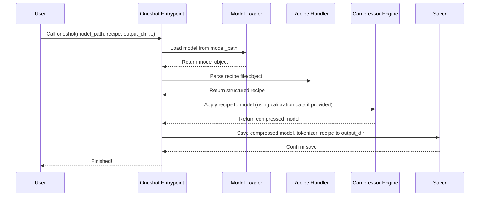
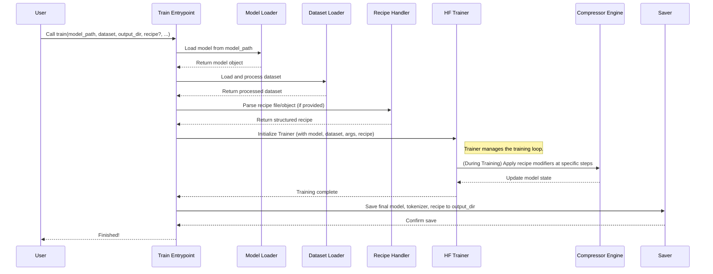

# Chapter 1: Entrypoints (`oneshot`, `train`)

Welcome to the `llm-compressor` tutorial! We're excited to help you learn how to make large language models (LLMs) smaller and faster.

Imagine you have a powerful but very large LLM, like a giant, knowledgeable robot that takes up a whole room. You want to shrink it down so it can fit on your laptop or phone, without making it forget too much. How do you start this shrinking process? That's where **Entrypoints** come in!

Think of entrypoints as the main doors or "Start" buttons for using `llm-compressor`. They are the first functions you'll typically call to begin compressing or fine-tuning your model. There are two main entrypoints: `oneshot` and `train`.

*   `oneshot`: This is like a quick tune-up station. You bring your pre-trained model, and `oneshot` applies compression techniques (like making the numbers it uses less precise, called quantization) *without* needing to re-train the whole model. It often uses a tiny bit of data just to calibrate the compression.
*   `train`: This is more like a workshop. You can use it to fine-tune your model (teach it a bit more on new data), perhaps after it's already been compressed. You can also use `train` to apply compression techniques that *require* the model to learn during the process.

Let's dive into each one.

## The `oneshot` Entrypoint: Quick Compression

**What it solves:** You have a pre-trained LLM, and you want to make it smaller and potentially faster *quickly*, without going through a long training process. This is often called "post-training" compression because it happens *after* the model was originally trained.

**How it works:** `oneshot` takes your model and applies compression techniques directly. For techniques like quantization (reducing the precision of the model's weights), it might look at a small amount of "calibration data" to make better decisions about how to compress without hurting performance too much.

**Example Use Case:** Let's say you have the `meta-llama/Meta-Llama-3-8B-Instruct` model and want to apply basic 8-bit quantization (W8A8) to make it smaller.

```python
# --- 1. Import necessary tools ---
from transformers import AutoModelForCausalLM, AutoTokenizer
from llmcompressor import oneshot
from llmcompressor.modifiers.quantization import QuantizationModifier # We'll learn about Modifiers later!

# --- 2. Define which model to compress ---
MODEL_ID = "meta-llama/Meta-Llama-3-8B-Instruct"
# Note: You might need to log in to Hugging Face for gated models like Llama 3

# --- 3. Load the model and tokenizer ---
# This gets the pre-trained model ready
model = AutoModelForCausalLM.from_pretrained(
    MODEL_ID,
    device_map="auto", # Automatically use GPU if available
    torch_dtype="auto" # Use appropriate data type
)
# This prepares the tool to process text for the model
tokenizer = AutoTokenizer.from_pretrained(MODEL_ID)

# --- 4. Define the compression "recipe" ---
# This tells oneshot HOW to compress. Here, we apply FP8 dynamic quantization.
# Don't worry too much about the details yet!
recipe = QuantizationModifier(
    targets="Linear",        # Apply to Linear layers
    scheme="FP8_DYNAMIC",    # Use FP8 quantization type
    ignore=["lm_head"]       # Don't quantize the final output layer
)

# --- 5. Run the oneshot compression! ---
print("Starting oneshot compression...")
oneshot(
    model=model,
    recipe=recipe,
    output_dir="./llama3_fp8_compressed" # Where to save the smaller model
    # We could also provide calibration data here using 'dataset' argument
)
print("Compression finished! Model saved to ./llama3_fp8_compressed")

```

**What happens when you run this?**

1.  `llm-compressor` takes your `model`.
2.  It reads the `recipe`, which says "Apply FP8 dynamic quantization to Linear layers, but skip `lm_head`."
3.  It applies this quantization. If we had provided a `dataset` argument with some calibration data, it would use that data to help decide the best way to quantize.
4.  It saves the now-quantized (smaller) model, the tokenizer, and the recipe file into the `./llama3_fp8_compressed` folder.

You now have a compressed version of the model, ready to be used or potentially fine-tuned further!

## The `train` Entrypoint: Fine-tuning and Training-Aware Compression

**What it solves:** Sometimes, `oneshot` compression might slightly reduce the model's accuracy. Or, maybe you want to use advanced compression techniques that work best *during* training (like Quantization Aware Training or gradual pruning). The `train` entrypoint handles these scenarios.

**How it works:** `train` uses the familiar Hugging Face `Trainer` to run a training or fine-tuning loop. You provide a model (it could be the original one or one you already compressed with `oneshot`), a dataset to train on, and potentially a [Recipe](03_recipe_.md) that specifies compression steps to apply *during* the training process.

**Example Use Case:** Let's take the FP8 model we just created with `oneshot` and fine-tune it a little bit on the `open_platypus` dataset to potentially recover some performance.

```python
# --- 1. Import necessary tools ---
from transformers import AutoModelForCausalLM
from transformers.utils.quantization_config import CompressedTensorsConfig
from llmcompressor import create_session, train # Note: using 'train' now

# --- 2. Define where our compressed model is ---
compressed_model_dir = "./llama3_fp8_compressed"
finetuned_output_dir = "./llama3_fp8_finetuned"

# --- 3. Load the COMPRESSED model ---
# IMPORTANT: We need to tell transformers how to load our compressed model
# 'run_compressed=False' means load it in its normal (decompressed) format for training
model = AutoModelForCausalLM.from_pretrained(
    compressed_model_dir,
    device_map="auto",
    quantization_config=CompressedTensorsConfig(run_compressed=False),
)

# --- 4. Define training details ---
dataset_name = "open_platypus" # Dataset for fine-tuning
max_steps = 25                # How many training steps (batches) to run

# --- 5. Run the training! ---
print(f"Starting fine-tuning for {max_steps} steps...")
# 'create_session' helps manage the compression state (more later!)
with create_session():
    train(
        model=model,                # Our compressed model
        dataset=dataset_name,       # Dataset name (llm-compressor helps load it)
        output_dir=finetuned_output_dir, # Where to save the fine-tuned model
        max_steps=max_steps,        # Limit training duration
        # Many other arguments control training details (batch size, learning rate etc.)
        # We'll cover these in the Arguments chapter!
    )
print(f"Fine-tuning finished! Model saved to {finetuned_output_dir}")

```

**What happens when you run this?**

1.  `llm-compressor` loads the previously compressed model (`llama3_fp8_compressed`), making sure it's ready for training.
2.  It prepares the `open_platypus` dataset.
3.  It sets up a training process using Hugging Face's `Trainer`.
4.  It runs the training loop for `max_steps` (25 steps in this case). If we had provided a [Recipe](03_recipe_.md) with training-time compression (like gradual pruning), those steps would happen *during* this loop.
5.  It saves the fine-tuned model into the `./llama3_fp8_finetuned` folder.

Now you have a model that is both compressed *and* fine-tuned!

## Under the Hood: What `oneshot` and `train` Do

While you can use these entrypoints without knowing every detail, a little insight helps!

**`oneshot` Flow:**

It's a relatively straightforward process:



The core logic lives in `src/llmcompressor/entrypoints/oneshot.py`. It uses helper functions from `src/llmcompressor/entrypoints/utils.py` for common tasks like loading models (`pre_process`) and saving them (`post_process`). The actual compression math happens deeper within the library, managed by the [Compression Session & Lifecycle](06_compression_session___lifecycle_.md).

**`train` Flow:**

This is a bit more involved because it includes a training loop:



The `train` function in `src/llmcompressor/entrypoints/train.py` orchestrates this. It relies heavily on a custom `Trainer` (found in `src/llmcompressor/transformers/finetune/trainer.py`) that's integrated with the `llm-compressor`'s [Compression Session & Lifecycle](06_compression_session___lifecycle_.md). This allows compression steps defined in a [Recipe](03_recipe_.md) to be applied at the right moments during training. It also uses the same `pre_process` and `post_process` helpers as `oneshot`.

## Conclusion

You've learned about the two main doorways into `llm-compressor`:

*   `oneshot`: For quick, post-training compression like quantization or pruning.
*   `train`: For fine-tuning models (compressed or not) and for compression techniques that happen *during* training.

These entrypoints handle the setup, execution, and saving, making it easier to start compressing your LLMs. But how do you tell `oneshot` or `train` *exactly* what model to use, what dataset, and precisely how to compress or train? You do that using **Arguments**.

Let's move on to the next chapter to explore how different argument types control the behavior of these entrypoints.

**Next:** [Chapter 2: Arguments (`ModelArguments`, `DatasetArguments`, `RecipeArguments`, `TrainingArguments`)](02_arguments___modelarguments____datasetarguments____recipearguments____trainingarguments___.md)

---

Generated by [AI Codebase Knowledge Builder](https://github.com/The-Pocket/Tutorial-Codebase-Knowledge)
