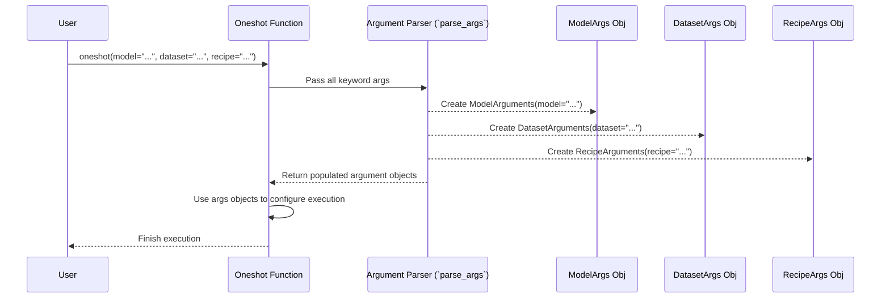

# Chapter 2: Arguments (`ModelArguments`, `DatasetArguments`, `RecipeArguments`, `TrainingArguments`)

In [Chapter 1: Entrypoints (`oneshot`, `train`)](01_entrypoints___oneshot____train___.md), we learned about the main "Start" buttons for `llm-compressor`: the `oneshot` function for quick compression and the `train` function for fine-tuning or training-aware compression.

But how do these functions know *which* model to compress, *what* data to use for calibration or training, *how* exactly to compress it, or *where* to save the results? That's where **Arguments** come in!

Think of Arguments as the detailed **settings panels** or **configuration files** for the `oneshot` and `train` functions. Just like you'd adjust settings in a video game (graphics quality, sound volume, difficulty) or tweak dials on a machine, these Arguments let you control precisely how `llm-compressor` operates.

`llm-compressor` organizes these settings into four main groups, each handling a specific aspect of the compression or training process:

1.  **`ModelArguments`**: Controls everything related to the model itself – loading it, identifying it, and saving it.
2.  **`DatasetArguments`**: Manages how data is loaded and prepared, whether it's for `oneshot` calibration or `train` fine-tuning.
3.  **`RecipeArguments`**: Specifies the compression instructions, known as the [Recipe](03_recipe_.md).
4.  **`TrainingArguments`**: Handles all the settings related to the training loop when using the `train` entrypoint (like learning rate, number of training steps, etc.).

Let's look at each one.

## `ModelArguments`: Your Model's ID Card

This group of settings tells `llm-compressor` about the language model you want to work with.

*   **Key Setting Example:** `model`
    *   **What it does:** Specifies which model to load. This could be a name from the Hugging Face Hub (like `"meta-llama/Meta-Llama-3-8B"`) or a path to a model saved on your computer (like `"./my_downloaded_model"`).
*   **Other Examples:** `cache_dir` (where to download/cache models from the Hub), `use_auth_token` (needed for private models), `save_compressed` (whether to save the final model using special compression techniques to save disk space).

**Analogy:** Think of `ModelArguments` like the section on a form where you fill in the name, version, and maybe the storage location of the specific robot (model) you want to modify.

```python
# Example: Using ModelArguments indirectly via keyword arguments
from llmcompressor import oneshot

# We tell oneshot WHICH model to use via the 'model' argument
# and WHERE to potentially cache downloads via 'cache_dir'
oneshot(
    model="hf-internal-testing/tiny-random-LlamaForCausalLM", # ModelArguments.model
    cache_dir="./model_cache",              # ModelArguments.cache_dir
    # ... other arguments for dataset, recipe, output ...
    output_dir="./tiny_llama_output", # Needed for saving
    recipe="zoo:llm/llama3-8b/quantization-w8a8-channelwise-dynamic", # Example recipe
    dataset="wikitext",               # Example dataset
    num_calibration_samples=64        # Example dataset arg
)

print("Oneshot finished. Model details were handled by ModelArguments.")
```
In this snippet, `model` and `cache_dir` are parameters controlled by `ModelArguments`. We pass them directly as keyword arguments to `oneshot`.

## `DatasetArguments`: Specifying Your Data Needs

This group controls how `llm-compressor` finds, loads, and prepares the data used during `oneshot` calibration or `train` fine-tuning.

*   **Key Setting Example:** `dataset`
    *   **What it does:** Specifies the dataset to use. This is often a name from the Hugging Face Hub (like `"wikitext"`, `"c4"`, or `"open_platypus"`).
*   **Other Examples:** `dataset_config_name` (if the dataset has specific configurations like `"wikitext-2-raw-v1"`), `num_calibration_samples` (how many data samples to use for `oneshot` calibration), `max_seq_length` (how long each text sample should be), `preprocessing_func` (a custom function to format the data).

**Analogy:** `DatasetArguments` are like specifying the textbook (`dataset` name), the chapter (`dataset_config_name`), and maybe how many pages (`num_calibration_samples`) the student (model) should study for a quick quiz (`oneshot`) or a longer lesson (`train`).

```python
# Example: Using DatasetArguments indirectly via keyword arguments
from llmcompressor import oneshot

# We tell oneshot WHAT dataset to use and HOW MUCH data for calibration
oneshot(
    model="hf-internal-testing/tiny-random-LlamaForCausalLM", # Model args
    dataset="wikitext",                     # DatasetArguments.dataset
    dataset_config_name="wikitext-2-raw-v1",# DatasetArguments.dataset_config_name
    num_calibration_samples=128,            # DatasetArguments.num_calibration_samples
    max_seq_length=512,                   # DatasetArguments.max_seq_length
    # ... other arguments for recipe, output ...
    recipe="zoo:llm/llama3-8b/quantization-w8a8-channelwise-dynamic", # Example recipe
    output_dir="./tiny_llama_output_data_args" # Needed for saving
)

print("Oneshot finished. Data settings were handled by DatasetArguments.")
```
Here, `dataset`, `dataset_config_name`, `num_calibration_samples`, and `max_seq_length` are parameters managed internally by `DatasetArguments`.

## `RecipeArguments`: Pointing to the Compression Plan

This group tells `llm-compressor` *how* to compress the model. It mainly points to a [Recipe](03_recipe_.md) file or definition.

*   **Key Setting Example:** `recipe`
    *   **What it does:** Specifies the compression recipe. This can be a path to a local YAML file (like `"./my_quant_recipe.yaml"`), a pre-built recipe from the `llm-compressor` "Zoo" (like `"zoo:llm/llama3-8b/quantization-w8a8-channelwise-dynamic"`), or even a Python object defining the recipe directly (as seen in Chapter 1's `oneshot` example).
*   **Other Examples:** `recipe_args` (allows overriding specific values within the recipe file, like changing `quantization_level: 8` to `quantization_level: 4`).

**Analogy:** `RecipeArguments` is like telling the system which instruction manual (`recipe`) to follow for the shrinking process.

```python
# Example: Using RecipeArguments indirectly via keyword arguments
from llmcompressor import oneshot

# We tell oneshot WHICH recipe to use
oneshot(
    model="hf-internal-testing/tiny-random-LlamaForCausalLM", # Model args
    dataset="wikitext",                     # Dataset args
    num_calibration_samples=64,             # Dataset args
    recipe="zoo:llm/llama3-8b/quantization-w8a8-channelwise-dynamic", # RecipeArguments.recipe
    # We could override parts of the recipe like this:
    # recipe_args={"quant_bitwidth": 4}, # RecipeArguments.recipe_args (as dict)
    # ... other arguments for output ...
    output_dir="./tiny_llama_output_recipe_args" # Needed for saving
)

print("Oneshot finished. Compression instructions were handled by RecipeArguments.")

```
The `recipe` parameter is the main knob controlled by `RecipeArguments`.

## `TrainingArguments`: Fine-Tuning Controls (for `train` only)

This group is specifically for the `train` entrypoint and controls the details of the fine-tuning process. It builds directly on top of the standard `TrainingArguments` from the Hugging Face `transformers` library, so if you've used that before, this will feel familiar.

*   **Key Setting Example:** `output_dir`
    *   **What it does:** Specifies where the final fine-tuned model, checkpoints, and training logs should be saved.
*   **Other Examples:** `learning_rate` (how quickly the model adapts during training), `per_device_train_batch_size` (how many data samples to process at once on each GPU), `max_steps` or `num_train_epochs` (how long to train for), `optim` (which optimization algorithm to use, like "adamw_torch").

**Analogy:** `TrainingArguments` are the settings for the 'workshop' phase (`train`). They define how long the training session runs (`max_steps`), how intensely the model learns (`learning_rate`), and where the improved model is stored (`output_dir`).

```python
# Example: Using TrainingArguments indirectly via keyword arguments in TRAIN
from llmcompressor import train

# We tell train WHERE to save, HOW LONG to train, and the LEARNING RATE
train(
    model="hf-internal-testing/tiny-random-LlamaForCausalLM", # Model args
    dataset="wikitext",                     # Dataset args
    output_dir="./tiny_llama_finetuned",    # TrainingArguments.output_dir
    max_steps=50,                           # TrainingArguments.max_steps
    learning_rate=0.0002,                   # TrainingArguments.learning_rate
    per_device_train_batch_size=2,          # TrainingArguments.per_device_train_batch_size
    # No recipe needed for simple fine-tuning, but could be added!
)

print("Training finished. Training settings were handled by TrainingArguments.")
```
In this `train` example, `output_dir`, `max_steps`, `learning_rate`, and `per_device_train_batch_size` are all managed by `TrainingArguments`.

## How It Works Under the Hood: Dataclasses and Parsing

You might wonder how `llm-compressor` takes all those keyword arguments like `model="..."` or `dataset="..."` and organizes them.

1.  **Dataclasses:** Each argument group (`ModelArguments`, `DatasetArguments`, `RecipeArguments`, `TrainingArguments`) is defined as a Python `dataclass`. A dataclass is essentially a class designed primarily to hold data, automatically providing helpful methods. You can see these definitions in the `src/llmcompressor/args/` directory.
    *   `src/llmcompressor/args/model_arguments.py`
    *   `src/llmcompressor/args/dataset_arguments.py`
    *   `src/llmcompressor/args/recipe_arguments.py`
    *   `src/llmcompressor/args/training_arguments.py` (inherits from `transformers.TrainingArguments`)

2.  **Hugging Face Argument Parser:** When you call `oneshot` or `train` with keyword arguments, `llm-compressor` uses a helper function (`parse_args` in `src/llmcompressor/args/utils.py`) which employs the `HfArgumentParser` from the Hugging Face `transformers` library. This parser is smart enough to look at all the keyword arguments you provided and automatically sort them into the correct dataclass objects (`ModelArguments`, `DatasetArguments`, etc.).

Here's a simplified view of what happens when you call `oneshot`:



This system makes it easy to pass configurations: you just use keyword arguments, and `llm-compressor` figures out where each setting belongs. You don't usually need to create the `ModelArguments` or `DatasetArguments` objects yourself unless you're doing something more advanced.

## Conclusion

Arguments are the control panel for `llm-compressor`. They allow you to precisely define *what* model and data to use, *how* to compress or train it, and *where* to save the results. By passing keyword arguments to the `oneshot` and `train` entrypoints, you configure their behavior through four key groups:

*   **`ModelArguments`**: For model loading and saving.
*   **`DatasetArguments`**: For data handling.
*   **`RecipeArguments`**: For specifying the compression plan.
*   **`TrainingArguments`**: For controlling the fine-tuning process (used only by `train`).

Understanding these argument groups is crucial for customizing `llm-compressor` to your specific needs. One of the most important arguments is `recipe`, which points to the detailed compression instructions.

Let's dive deeper into what makes up these compression instructions in the next chapter.

**Next:** [Chapter 3: Recipe](03_recipe_.md)

---

Generated by [AI Codebase Knowledge Builder](https://github.com/The-Pocket/Tutorial-Codebase-Knowledge)