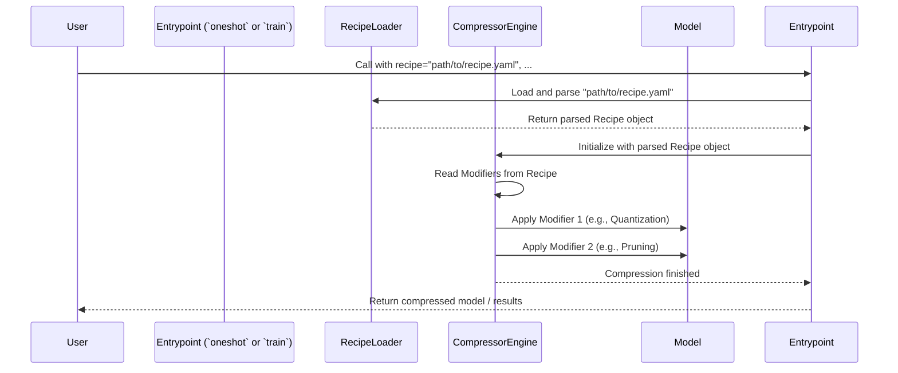

# Chapter 3: Recipe

In [Chapter 2: Arguments](02_arguments___modelarguments____datasetarguments____recipearguments____trainingarguments___.md), we learned how different arguments control the `oneshot` and `train` entrypoints. One crucial argument, often found in `RecipeArguments`, is the `recipe` argument. This argument points to the heart of the compression process: the **Recipe**.

Imagine you want to bake a cake (compress a model). You wouldn't just throw ingredients (compression techniques) together randomly! You'd follow a recipe that tells you *what* ingredients to use, *how much* of each, and *when* to add them. That's exactly what a Recipe does for `llm-compressor`!

## What Problem Does a Recipe Solve?

Compressing a large language model often involves multiple steps and techniques. Maybe you want to:

1.  Make the model's weights less precise (Quantization).
2.  Remove some less important connections (Pruning).
3.  Fine-tune the model slightly afterwards.

How do you tell `llm-compressor` to do *exactly* this, in this specific order, with these specific settings (like "8-bit quantization" or "50% sparsity")?

A **Recipe** is the answer. It's like a detailed instruction manual or a cooking recipe specifically for compressing your LLM. It clearly defines:

*   **What:** Which compression techniques ([Modifiers](04_modifier_.md)) to use (e.g., Quantization, Pruning).
*   **When:** At which point to apply them (this is more relevant for the `train` entrypoint, e.g., apply pruning between training steps 100 and 500). For `oneshot`, it usually happens immediately.
*   **How:** The exact parameters for each technique (e.g., use 8-bit precision, target only certain parts of the model, aim for 50% sparsity).

Recipes are usually written in a simple text format called **YAML**, which makes them very easy to read, write, share, and modify.

## Our Goal: Simple Quantization with a Recipe File

Let's revisit the `oneshot` example from Chapter 1, but this time, instead of defining the compression steps directly in Python code, we'll put them in a dedicated Recipe file.

Our goal: Apply basic 8-bit (W8A8) dynamic quantization to a tiny test model using a YAML recipe file.

**Step 1: Create the Recipe File**

First, create a new text file named `my_quant_recipe.yaml`. Put the following content inside it:

```yaml
# my_quant_recipe.yaml

# This section lists the compression techniques (Modifiers) to apply
modifiers:
  # We are using the QuantizationModifier
  QuantizationModifier:
    # Apply quantization to layers of type "Linear"
    targets: ["Linear"]
    # Use the W8A8 dynamic scheme (8-bit weights, 8-bit dynamic activations)
    scheme: W8A8_DYNAMIC
    # Don't quantize the final 'lm_head' layer, as it can hurt accuracy
    ignore: ["lm_head"]
```

**Explanation:**

*   `modifiers:`: This is the main section where we list our compression instructions.
*   `QuantizationModifier:`: This tells `llm-compressor` we want to use the built-in quantization technique. We'll learn more about specific [Modifiers](04_modifier_.md) in the next chapter.
*   `targets: ["Linear"]`: This specifies *which* parts of the model to apply quantization to (in this case, the standard 'Linear' layers).
*   `scheme: W8A8_DYNAMIC`: This sets *how* to quantize - using an 8-bit weight, 8-bit dynamic activation scheme.
*   `ignore: ["lm_head"]`: This tells the modifier to skip quantizing a specific layer named `lm_head`.

This YAML file is our "instruction manual" for quantization.

**Step 2: Use the Recipe File with `oneshot`**

Now, let's write a Python script to use this recipe file.

```python
# --- 1. Import necessary tools ---
from llmcompressor import oneshot

# --- 2. Define which model to compress ---
# Using a tiny model for quick testing
MODEL_ID = "hf-internal-testing/tiny-random-LlamaForCausalLM"
# Define the path to our recipe file
RECIPE_PATH = "my_quant_recipe.yaml"

# --- 3. Run the oneshot compression! ---
print(f"Starting oneshot compression using recipe: {RECIPE_PATH}")
oneshot(
    model=MODEL_ID,                       # Model to compress
    dataset="wikitext",                   # Dataset for calibration
    dataset_config_name="wikitext-2-raw-v1", # Specific dataset version
    num_calibration_samples=64,           # How much data to use for calibration
    recipe=RECIPE_PATH,                   # <<< POINT TO OUR RECIPE FILE!
    output_dir="./tiny_llama_quantized_from_recipe" # Where to save results
)
print("Compression finished! Model saved to ./tiny_llama_quantized_from_recipe")

```

**Explanation:**

*   We import `oneshot` as usual.
*   We define the model and, importantly, the `RECIPE_PATH` to our YAML file.
*   In the `oneshot` call, the `recipe` argument is now set to `RECIPE_PATH` (the string containing the filename).
*   `llm-compressor` will automatically find `my_quant_recipe.yaml`, read it, understand the instructions (`QuantizationModifier` with its parameters), and apply them to the model during the `oneshot` process.

When you run this, `llm-compressor` performs the W8A8 dynamic quantization exactly as defined in `my_quant_recipe.yaml` and saves the compressed model. Using a YAML file makes your compression strategy much clearer and easier to manage than embedding it directly in the Python code, especially for complex scenarios.

## Recipe Structure (YAML Format)

Let's look a bit closer at how recipes are typically structured in YAML.

```yaml
# Optional: Version of the recipe format (good practice)
version: 1.0

# Optional: Global arguments that can be reused within the recipe
# Example: Define a target sparsity level once
args:
  target_sparsity: 0.5
  quant_bits: 8

# Optional: Metadata about the recipe (for documentation)
metadata:
  description: "Example recipe showing structure"
  author: "Beginner AI"

# --- Stages (Optional but common for complex recipes) ---
# You can group modifiers into named stages.
# This is often used with the 'train' entrypoint to apply different
# techniques at different phases of training.

quant_stage: # Name of the first stage
  # Modifiers applied during this stage
  quantization_modifiers: # Group name often ends in '_modifiers'
    QuantizationModifier:
      targets: ["Linear"]
      # Use the global 'quant_bits' argument defined above
      scheme: FAKE # Just an example, not a real scheme
      bits: eval(quant_bits) # 'eval' can use values from 'args'
      start: 0 # When using 'train', specifies start step/epoch
      end: 1   # When using 'train', specifies end step/epoch

pruning_stage: # Name of the second stage
  pruning_modifiers:
    MagnitudePruningModifier:
      targets: ["re:model.layers.*\.mlp.*"] # Target specific layers using patterns
      # Use the global 'target_sparsity' argument
      final_sparsity: eval(target_sparsity)
      start: 1 # Start after quantization finishes
      end: 5   # End later in training

# --- OR Simple Structure (like our first example) ---
# If you don't need stages (common for 'oneshot'),
# you can just list modifiers directly.

# modifiers: # This is equivalent to a single, unnamed stage
#   QuantizationModifier:
#     targets: ["Linear"]
#     scheme: W8A8_DYNAMIC
#     ignore: ["lm_head"]

```

**Key Parts:**

*   **`args` (Optional):** Define variables here (like `target_sparsity`) that you can reuse later in the recipe using `eval()`. This avoids repeating the same value multiple times.
*   **`metadata` (Optional):** Add notes about the recipe's purpose, author, etc.
*   **Stages (e.g., `quant_stage`, `pruning_stage`):** Named blocks that group related [Modifiers](04_modifier_.md). This helps organize complex, multi-step compression strategies, especially for training-time compression where timing (`start`, `end` epochs/steps) is important. Each stage often contains groups of modifiers (like `quantization_modifiers`, `pruning_modifiers`).
*   **Modifiers (e.g., `QuantizationModifier`, `MagnitudePruningModifier`):** These are the actual compression instructions. Each modifier has its own specific parameters (`targets`, `scheme`, `final_sparsity`, `start`, `end`, etc.) that control *how* and *when* it works. We'll explore these in [Chapter 4: Modifier](04_modifier_.md).
*   **Simple Structure:** For basic recipes (especially with `oneshot`), you might just have a top-level `modifiers:` section without explicit stages, like in our first example.

Using YAML for recipes provides a standardized, readable, and powerful way to define even complex compression workflows.

## How It Works Under the Hood

What happens when you pass `recipe="my_quant_recipe.yaml"` to `oneshot` or `train`?

1.  **Argument Parsing:** The [RecipeArguments](02_arguments___modelarguments____datasetarguments____recipearguments____trainingarguments___.md) object receives the file path `"my_quant_recipe.yaml"`.
2.  **Recipe Loading:** `llm-compressor` identifies that the `recipe` argument is a file path. It opens and reads the content of `my_quant_recipe.yaml`.
3.  **YAML Parsing:** The text content is parsed using a YAML library. This converts the structured text into Python objects (like dictionaries and lists) that the code can understand. Specifically, it often creates instances of internal classes like `Recipe`, `RecipeStage`, and `RecipeModifier` (defined in `src/llmcompressor/recipe/`).
4.  **Recipe Representation:** The parsed information is stored internally, representing the list of modifiers and their parameters.
5.  **Modifier Application:** During the `oneshot` calibration or the `train` loop, the [Compression Session & Lifecycle](06_compression_session___lifecycle_.md) manager consults this internal recipe representation. It identifies which [Modifiers](04_modifier_.md) need to be applied and uses their parameters to modify the model accordingly.

Here’s a simplified view:



The core logic for loading and representing recipes resides in the `src/llmcompressor/recipe/` directory, particularly in `recipe.py` which defines the main `Recipe` class.

```python
# Conceptual example of how a recipe might be loaded internally
# (Actual code is more complex)

from llmcompressor.recipe import Recipe

recipe_path = "my_quant_recipe.yaml"

try:
    # The library uses a method like this to load from file or string
    parsed_recipe = Recipe.create_instance(recipe_path)
    print(f"Successfully parsed recipe from {recipe_path}")

    # The 'parsed_recipe' object now holds the instructions
    # (e.g., QuantizationModifier details) ready for use.
    # Modifiers can be created from the parsed recipe:
    # stage_modifiers_list = parsed_recipe.create_modifier()

except Exception as e:
    print(f"Error parsing recipe: {e}")

```

This internal parsing step translates the human-readable YAML file into structured objects that the compression engine can execute.

## Conclusion

You've learned that a **Recipe** is the cornerstone of defining *how* to compress your model in `llm-compressor`. It's typically a **YAML file** that acts as a detailed instruction manual, specifying:

*   **What** compression techniques ([Modifiers](04_modifier_.md)) to use.
*   **When** to apply them (especially relevant for `train`).
*   **How** to configure them (parameters like bits, sparsity, targets).

Using Recipes makes your compression strategies clear, repeatable, and easy to share. While simple recipes can be defined directly as Python objects, using YAML files is recommended for clarity and complexity management.

But what exactly *are* these "Modifiers" listed in the recipe, like `QuantizationModifier` or `MagnitudePruningModifier`? They are the specific tools that perform the actual compression work.

Let's dive into them in the next chapter!

**Next:** [Chapter 4: Modifier](04_modifier_.md)

---

Generated by [AI Codebase Knowledge Builder](https://github.com/The-Pocket/Tutorial-Codebase-Knowledge)
