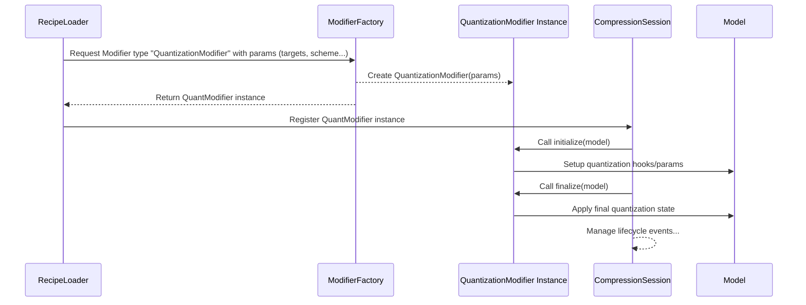

# Chapter 4: Modifier

In [Chapter 3: Recipe](03_recipe_.md), we learned that a Recipe is like an instruction manual for compressing our model, often written in a YAML file. It tells `llm-compressor` *what* techniques to use and *how* to configure them.

But what are these "techniques" listed inside the Recipe? If the Recipe is the cookbook, what are the individual kitchen gadgets that do the actual work? That's where **Modifiers** come in!

## What Problem Do Modifiers Solve?

Imagine your Recipe says "reduce the precision of the numbers" and "remove some unimportant connections". How does `llm-compressor` actually *do* these things?

A **Modifier** is the specific tool or algorithm that performs a single compression task. Think of them as specialized kitchen gadgets:

*   `QuantizationModifier`: Like a food scale that helps you use less flour (reduces numerical precision).
*   `SparseGPTModifier` or `WANDA`: Like a precise knife that carefully removes unnecessary ingredients (pruning weights).
*   `SmoothQuantModifier`: Like a blender that smooths out lumpy ingredients *before* you weigh them, making the weighing (quantization) more accurate.

Each Modifier encapsulates the code logic for one specific compression technique. The [Recipe](03_recipe_.md) tells `llm-compressor` *which* Modifier "gadget" to pick up and *how* to set its dials (parameters).

## Modifiers in a Recipe: A Closer Look

Let's look back at the `my_quant_recipe.yaml` file from Chapter 3:

```yaml
# my_quant_recipe.yaml

modifiers:
  # This is the Modifier we're using!
  QuantizationModifier:
    # --- These are the parameters for this specific Modifier ---
    targets: ["Linear"]       # Which parts of the model to target?
    scheme: W8A8_DYNAMIC    # What quantization method to use?
    ignore: ["lm_head"]       # Any specific parts to skip?
    # ----------------------------------------------------------
```

**Explanation:**

1.  `modifiers:`: This section in the Recipe lists the tools we want to use.
2.  `QuantizationModifier:`: This line explicitly names the **Modifier** we are activating. We are telling `llm-compressor` to use the built-in tool designed for quantization.
3.  **Parameters (`targets`, `scheme`, `ignore`):** These lines are the *settings* for the `QuantizationModifier`. They are defined within the [Recipe](03_recipe_.md) and tell the `QuantizationModifier` exactly how to behave:
    *   `targets: ["Linear"]`: "Only apply quantization to layers of type 'Linear'."
    *   `scheme: W8A8_DYNAMIC`: "Use the 8-bit weight, 8-bit dynamic activation method."
    *   `ignore: ["lm_head"]`: "Do not quantize the layer named 'lm_head'."

So, the [Recipe](03_recipe_.md) selects the Modifier (`QuantizationModifier`) and configures its specific parameters.

## How Modifiers Work in the Process

When you run `oneshot` or `train` with a [Recipe](03_recipe_.md), `llm-compressor` reads the recipe and figures out which Modifiers are listed. For each Modifier:

1.  **Instantiation:** It creates an instance (an active object) of the specified Modifier class (like `QuantizationModifier`).
2.  **Configuration:** It passes the parameters from the recipe (like `targets`, `scheme`) to this instance.
3.  **Lifecycle Integration:** The Modifier instance is then integrated into the compression process, managed by the [Compression Session & Lifecycle](06_compression_session___lifecycle_.md). Modifiers have specific points where they can act:
    *   **Initialization:** When the process starts (`initialize`). This might involve setting up hooks or preparing the model.
    *   **During Steps (for `train`):** Modifiers can react to events during training (`update_event`), like applying gradual pruning over several steps. For `oneshot`, this is usually less complex and happens during calibration.
    *   **Finalization:** When the process ends (`finalize`), the Modifier might perform cleanup actions or apply final changes.

## Common Types of Modifiers

`llm-compressor` comes with several built-in Modifiers. Here are a few common categories:

*   **Quantization Modifiers:** These reduce the precision of the numbers (weights and/or activations) used by the model, making it smaller and often faster.
    *   `QuantizationModifier`: The standard tool for various quantization schemes (like FP8, INT8).
    *   `GPTQModifier`: An advanced quantization technique (like `QuantizationModifier` but uses calibration data differently to minimize error for weights).
*   **Pruning Modifiers:** These remove (set to zero) weights in the model, creating sparsity. This can significantly reduce model size.
    *   `SparseGPTModifier`: A sophisticated one-shot pruning method using calibration data.
    *   `WANDA`: Another one-shot pruning method, often faster but potentially less accurate than SparseGPT.
    *   `MagnitudePruningModifier`: A simpler method that prunes weights based only on their size (magnitude), without needing calibration data.
*   **"Helper" Modifiers:** These don't directly compress but often prepare the model for other modifiers or help maintain accuracy.
    *   `SmoothQuantModifier`: Adjusts activations and weights to make subsequent quantization more effective.
    *   `ConstantPruningModifier`: Used during fine-tuning (`train`) *after* pruning to ensure the removed weights *stay* removed.
    *   `DistillationModifier`: Used during fine-tuning to help a compressed (student) model learn from a larger (teacher) model, improving accuracy.

You can find more details about these in the `llm-compressor` codebase (specifically the README in `src/llmcompressor/modifiers/`). The [Recipe](03_recipe_.md) allows you to combine these different Modifiers to create sophisticated compression strategies.

## Under the Hood: From Recipe Name to Action

How does `llm-compressor` know what code to run when it sees `QuantizationModifier:` in your recipe?

1.  **Modifier Factory:** `llm-compressor` has a central registry called the `ModifierFactory` (primarily found in `src/llmcompressor/modifiers/factory.py`). When the library starts, it scans specific directories (like `src/llmcompressor/modifiers/quantization/`) and registers all the Modifier classes it finds (like `QuantizationModifier`, `GPTQModifier`, etc.) under their class names.
2.  **Recipe Parsing:** When your YAML recipe is loaded, the parser identifies `QuantizationModifier:` as the type of modifier needed.
3.  **Creation Request:** The system asks the `ModifierFactory` to create a Modifier of type `"QuantizationModifier"`.
4.  **Instantiation:** The `ModifierFactory` finds the registered `QuantizationModifier` class and creates an instance of it, passing along the parameters (`targets`, `scheme`, `ignore`, etc.) defined in the recipe.
5.  **Execution:** This specific `QuantizationModifier` object is then managed by the [Compression Session & Lifecycle](06_compression_session___lifecycle_.md) and performs its actions (like applying quantization) at the appropriate times (initialization, calibration, finalization).

Here's a simplified view:



All Modifiers generally inherit from a base `Modifier` class (defined in `src/llmcompressor/modifiers/modifier.py`) which outlines the standard methods like `initialize`, `finalize`, and `update_event` that the [Compression Session & Lifecycle](06_compression_session___lifecycle_.md) uses to interact with them.

```python
# Conceptual Python representation (Simplified)
from llmcompressor.modifiers import Modifier
from llmcompressor.core import State, Event

class MyExampleModifier(Modifier):
    # Parameters from the recipe would be stored here, e.g.,
    # self.target_sparsity = 0.5

    def on_initialize(self, state: State, **kwargs) -> bool:
        # Code to run when the modifier first starts
        print(f"Initializing {self.__class__.__name__}...")
        # Example: Prepare the model layers based on self.targets
        self.prepare_model(state.model)
        return True # Indicate success

    def on_finalize(self, state: State, **kwargs) -> bool:
        # Code to run when the compression process finishes
        print(f"Finalizing {self.__class__.__name__}...")
        # Example: Apply final changes or clean up
        self.apply_final_changes(state.model)
        return True # Indicate success

    def on_update(self, state: State, event: Event, **kwargs):
        # Code to run during the process (e.g., each training step)
        # Only relevant if modifier needs updates over time
        if self.should_act_on_event(event):
            print(f"Updating {self.__class__.__name__} at step {event.current_index}")
            self.perform_update_step(state.model)

    # --- Helper methods specific to this modifier ---
    def prepare_model(self, model): pass
    def apply_final_changes(self, model): pass
    def should_act_on_event(self, event): return False # Example default
    def perform_update_step(self, model): pass

# --- Somewhere else, the Factory would create it based on the recipe ---
# recipe_params = {"targets": ["Linear"], "scheme": "W8A8_DYNAMIC"}
# modifier_instance = ModifierFactory.create("QuantizationModifier", **recipe_params)
# compression_session.add_modifier(modifier_instance)
```

This structure allows `llm-compressor` to be easily extended with new compression algorithms – you just need to create a new class that inherits from `Modifier` and implements the required methods, then the `ModifierFactory` can pick it up and use it based on its name in a [Recipe](03_recipe_.md).

## Conclusion

You've now learned that **Modifiers** are the individual tools or algorithms within `llm-compressor` that perform specific compression tasks like quantization (`QuantizationModifier`) or pruning (`SparseGPTModifier`).

*   They are selected and configured using parameters defined in the [Recipe](03_recipe_.md).
*   They encapsulate the complex logic for each compression technique.
*   They interact with the model during the [Compression Session & Lifecycle](06_compression_session___lifecycle_.md) (initialization, steps, finalization).
*   `llm-compressor` uses a `ModifierFactory` to find and create the correct Modifier instance based on the name specified in the recipe.

Understanding Modifiers helps you see how the high-level instructions in a Recipe translate into concrete actions performed on your model.

But how do some Modifiers, especially those dealing with quantization or advanced pruning, know *how* to best modify the model? They often need to observe the model's behavior on real data. This is where **Observers** come into play.

**Next:** [Chapter 5: Observer](05_observer_.md)

---

Generated by [AI Codebase Knowledge Builder](https://github.com/The-Pocket/Tutorial-Codebase-Knowledge)