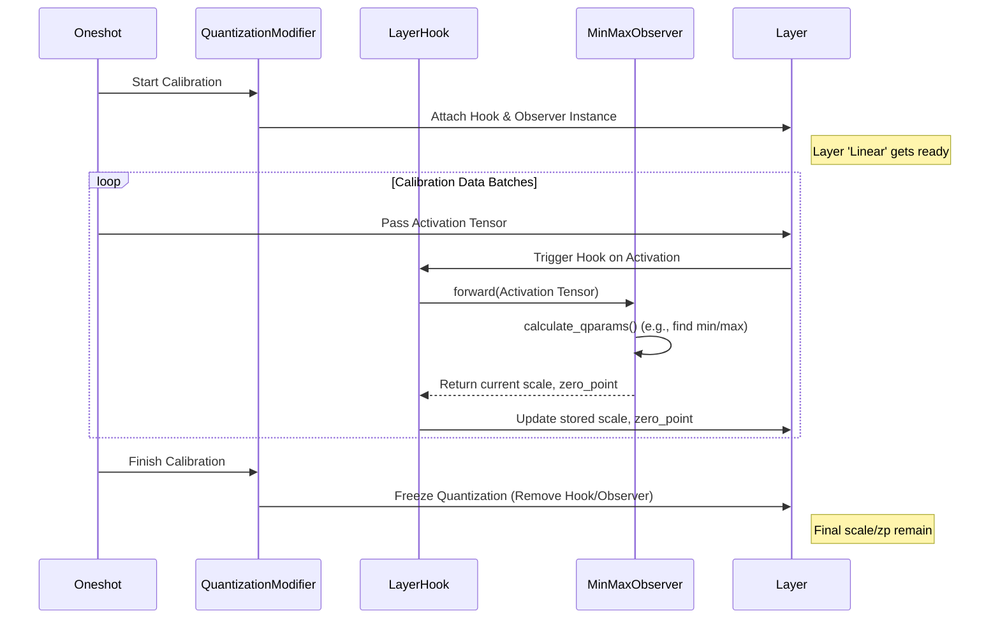

# Chapter 5: Observer

In [Chapter 4: Modifier](04_modifier_.md), we learned about Modifiers, the tools like `QuantizationModifier` that perform specific compression tasks based on instructions in a [Recipe](03_recipe_.md). We saw that a `QuantizationModifier` can reduce the numerical precision of a model.

But how does it know the *best* way to do this? How does it decide the range of the smaller numbers (like 8-bit integers) to represent the original floating-point numbers without losing too much information? It needs to *observe* the typical values that flow through the model first. This is where **Observers** come in!

## What Problem Do Observers Solve?

Imagine you're setting up a microphone for a speaker. If you set the sensitivity too low, the voice will be too quiet. If you set it too high, it might get distorted. You need to listen to the speaker's normal volume range first to find the best setting.

**Observers** act like these listeners, but for the numerical values inside a language model. Specifically, during a phase called **calibration** (often part of the `oneshot` entrypoint), certain [Modifiers](04_modifier_.md) like `QuantizationModifier` need to figure out the optimal `scale` and `zero_point` parameters.

*   **Scale:** Tells us the ratio between the original floating-point range and the new integer range. Like the size of one "step" in the integer scale.
*   **Zero Point:** Tells us which integer value corresponds to the floating-point value 0.0.

To find the best `scale` and `zero_point`, the Modifier needs to know the typical range of values (activations) passing through different points in the model. This is the job of an Observer:

*   **What:** Watch the activation values flowing through specific inputs or outputs of layers during calibration.
*   **Why:** Calculate the optimal `scale` and `zero_point` to minimize information loss when converting these activations to a lower precision (like int8).

Different Observers use different strategies for this calculation:

*   **MinMaxObserver:** Simply looks at the absolute minimum and maximum values seen during calibration.
*   **MovingAverageMSEObserver:** Tries to find the range that minimizes the Mean Squared Error (MSE) between the original values and the quantized values, often using a moving average to smooth the results.

**Analogy:** Think of an Observer like a thermometer placed in a room (a layer in the model). It measures the minimum and maximum temperatures (activation values) over a period (calibration) to help decide what kind of clothing (quantization parameters) is most appropriate for that room's climate.

## How Observers Are Used (Usually Indirectly)

Here's the important part for beginners: **You usually don't interact directly with Observers!**

Observers are internal helpers used *by* [Modifiers](04_modifier_.md), particularly `QuantizationModifier` when dealing with "static" quantization of activations (where the `scale` and `zero_point` are fixed after calibration).

The [Recipe](03_recipe_.md) configures the `QuantizationModifier`, and the modifier itself decides which Observer to use based on the chosen `scheme` or other parameters.

Let's look at a `QuantizationModifier` snippet in a recipe again:

```yaml
# Example Recipe Snippet (my_quant_recipe.yaml)
modifiers:
  QuantizationModifier:
    targets: ["Linear"]
    # Scheme often implies the observer strategy for activations
    scheme: W8A8 # 8-bit Weights, 8-bit (Static) Activations
    # --- Observer configuration is often IMPLICIT here ---
    # For static activation quantization (A8 part of W8A8),
    # the QuantizationModifier might default to using a MinMaxObserver
    # or allow specifying one like:
    # activation_observer: minmax
    # or
    # activation_observer:
    #   name: mse
    #   averaging_constant: 0.01 # Parameters for the observer
    # --- But often, you rely on the default behavior ---
```

**Explanation:**

*   When you set `scheme: W8A8`, the `A8` part signifies 8-bit *activations*. For static quantization (the default unless specified otherwise, like `W8A8_DYNAMIC`), the `QuantizationModifier` needs to figure out the `scale` and `zero_point` for these activations during calibration.
*   Internally, the `QuantizationModifier` will likely instantiate and use an **Observer** (like `MinMaxObserver` or `MovingAverageMSEObserver`) to watch the activations flowing through the targeted `Linear` layers during the calibration phase.
*   While you *can* sometimes specify observer details in the recipe (like `activation_observer:`), it's often handled automatically based on the `scheme`.

So, you tell the `QuantizationModifier` *what* precision you want (`A8`), and it uses an appropriate Observer "sensor" behind the scenes to figure out the best `scale` and `zero_point` during calibration.

## Under the Hood: How Observers Work During Calibration

Let's trace the journey of an Observer during the `oneshot` calibration process when static activation quantization is used.

**Step-by-Step Flow:**

1.  **Initialization:** The `QuantizationModifier` is created based on the [Recipe](03_recipe_.md). It knows it needs to quantize activations statically.
2.  **Hook Setup:** Before calibration starts, the `QuantizationModifier` attaches "hooks" to the inputs and/or outputs of the target layers (e.g., `Linear` layers). These hooks are associated with an Observer instance (e.g., `MinMaxObserver`).
3.  **Calibration Data Flow:** The `oneshot` entrypoint feeds calibration data samples through the model.
4.  **Hook Triggered:** When data reaches the input/output of a hooked layer, the hook function executes.
5.  **Observer Called:** The hook function passes the activation tensor (the actual numerical values) to its associated `Observer` instance (e.g., `observer.forward(activation_tensor)`).
6.  **Calculation:** The `Observer` analyzes the tensor. For example, `MinMaxObserver` finds the minimum and maximum values seen *so far* across all calibration batches.
7.  **Parameter Update:** Based on its internal state (e.g., the running min/max), the Observer calculates the current best `scale` and `zero_point`. These might be updated continuously during calibration.
8.  **Storing Results:** The calculated `scale` and `zero_point` are stored, often directly as parameters within the layer module itself.
9.  **Calibration Ends:** After processing all calibration samples (or `num_calibration_steps`), the `oneshot` process finishes calibration.
10. **Freezing:** The `QuantizationModifier` finalizes the process. It usually removes the hooks and the Observers, leaving the final calculated `scale` and `zero_point` attached to the layers, ready for quantized inference.

**Sequence Diagram:**



**Diving into the Code (Simplified):**

Observers live in the `src/llmcompressor/observers/` directory. All observers inherit from a base class:

```python
# --- File: src/llmcompressor/observers/base.py (Simplified) ---
from torch.nn import Module
from compressed_tensors.quantization.quant_args import QuantizationArgs
# ... other imports

class Observer(Module, RegistryMixin):
    """
    Base Observer class. Subclasses implement specific strategies.
    """
    def __init__(self, quantization_args: QuantizationArgs):
        # Stores quantization settings (like number of bits)
        self.quantization_args: QuantizationArgs = quantization_args
        super().__init__()
        # Internal state to store calculated params
        self._scale = None
        self._zero_point = None
        # ... (maybe other state like num_observed_tokens)

    @torch.no_grad()
    def forward(self, observed: Tensor, ...) -> Tuple[FloatTensor, IntTensor]:
        # This is called by the hook during calibration
        # It updates internal state and calculates parameters
        # ...
        return self.get_qparams(observed=observed, ...)

    def calculate_qparams(self, observed: Tensor, ...) -> Tuple[FloatTensor, IntTensor]:
        # *** Subclasses MUST implement this method ***
        # This is where the core logic lives (e.g., find min/max, calc MSE)
        raise NotImplementedError

    def get_qparams(self, observed: Optional[Tensor] = None, ...) -> Tuple[FloatTensor, IntTensor]:
        # Helper to manage different calculation strategies (per-tensor, per-channel, etc.)
        # Calls self.calculate_qparams internally
        # ... calculation logic based on self.quantization_args.strategy ...
        return self_scale, self._zero_point

    def reset(self):
        # Resets the observer's internal state (e.g., min/max values)
        # ...
```

This base `Observer` defines the interface. The actual calculation happens in subclasses like `MinMaxObserver`:

```python
# --- File: src/llmcompressor/observers/min_max.py (Simplified) ---
from llmcompressor.observers.base import Observer
from compressed_tensors.quantization.utils import calculate_qparams # Helper
# ... other imports

@Observer.register("minmax") # Makes it available via the name "minmax"
class MinMaxObserver(Observer):
    def __init__(self, quantization_args: QuantizationArgs, averaging_constant: float = 1.0):
        super().__init__(quantization_args=quantization_args)
        # State specific to MinMaxObserver
        self.min_val = {} # Store running minimum
        self.max_val = {} # Store running maximum
        self.averaging_constant = averaging_constant # For optional smoothing

    def calculate_qparams(self, observed: torch.Tensor, ...) -> Tuple[torch.FloatTensor, torch.IntTensor]:
        # --- Core MinMax Logic ---
        # 1. Find the min and max in the current batch
        min_val_batch, max_val_batch = torch.aminmax(observed) # Simple min/max finding

        # 2. Update the running min/max (potentially with smoothing)
        # (Simplified: assumes averaging_constant = 1.0, no smoothing)
        current_min = self.min_val.get("default", min_val_batch)
        current_max = self.max_val.get("default", max_val_batch)
        updated_min = torch.minimum(current_min, min_val_batch)
        updated_max = torch.maximum(current_max, max_val_batch)
        self.min_val["default"] = updated_min
        self.max_val["default"] = updated_max
        # -------------------------

        # 3. Calculate scale/zp from the updated min/max range
        scale, zero_point = calculate_qparams(
            updated_min, updated_max, self.quantization_args
        )
        return scale, zero_point

    def reset(self):
        super().reset()
        self.min_val = {}
        self.max_val = {}
```

And how does the `QuantizationModifier` use this? It happens within its calibration logic, often involving helper functions that manage hooks and observer calls.

```python
# --- File: src/llmcompressor/modifiers/quantization/calibration.py (Conceptual Snippet) ---
from llmcompressor.observers import Observer # Can get Observer classes

def initialize_observer(module: Module, base_name: str):
    # Called by QuantizationModifier to set up an observer on a layer
    quantization_args = module.quantization_scheme.get_args(base_name) # e.g., for 'input_activations'
    if quantization_args and not quantization_args.dynamic:
        # Get the observer type name (e.g., 'minmax' or 'mse') from args or default
        observer_name = quantization_args.observer # Or a default name
        # Create the observer instance (using the Observer registry)
        observer = Observer.load_from_registry(observer_name, quantization_args=quantization_args)
        # Attach it to the module (e.g., module.input_observer = observer)
        module.register_module(f"{base_name}_observer", observer)

def calibrate_input_hook(module: Module, args: Any):
    # This function is registered as a 'hook' on the layer's input
    # It gets called automatically when data flows in during calibration
    input_tensor = args[0]
    # Find the observer attached to this module
    input_observer = getattr(module, "input_observer")
    # Call the observer's forward method to update stats and get qparams
    scale, zp = input_observer(input_tensor)
    # Store the calculated scale and zero_point on the module
    update_parameter_data(module, scale, "input_scale")
    update_parameter_data(module, zp, "input_zero_point")

# --- QuantizationModifier would use these during calibration ---
# modifier.apply(initialize_observer) # Set up observers on layers
# modifier.register_hook(module, calibrate_input_hook, "forward_pre") # Attach hooks
# # ... run calibration data ...
# modifier.remove_hooks() # Clean up
```

This shows the connection: The [Modifier](04_modifier_.md) sets up the Observer, registers hooks that call the Observer during calibration, and the Observer calculates the parameters needed for quantization.

## Conclusion

You've learned that **Observers** are like internal sensors used by compression [Modifiers](04_modifier_.md) (especially `QuantizationModifier`) during the calibration phase.

*   They **watch** the range of activation values flowing through the model.
*   They **calculate** the optimal `scale` and `zero_point` parameters needed for quantization, aiming to minimize information loss.
*   Common strategies include **MinMax** and **MSE**.
*   You typically configure them **indirectly** via the [Modifier's](04_modifier_.md) settings in the [Recipe](03_recipe_.md), rather than interacting with them directly.

Observers are a crucial behind-the-scenes component that enables effective static quantization.

Now that we've seen the main building blocks – [Entrypoints](01_entrypoints___oneshot____train___.md), [Arguments](02_arguments___modelarguments____datasetarguments____recipearguments____trainingarguments___.md), [Recipes](03_recipe_.md), [Modifiers](04_modifier_.md), and Observers – how does `llm-compressor` manage the whole process? How does it coordinate these pieces, especially during potentially complex training-aware compression?

Let's explore the overall management system in the next chapter.

**Next:** [Chapter 6: Compression Session & Lifecycle](06_compression_session___lifecycle_.md)

---

Generated by [AI Codebase Knowledge Builder](https://github.com/The-Pocket/Tutorial-Codebase-Knowledge)
