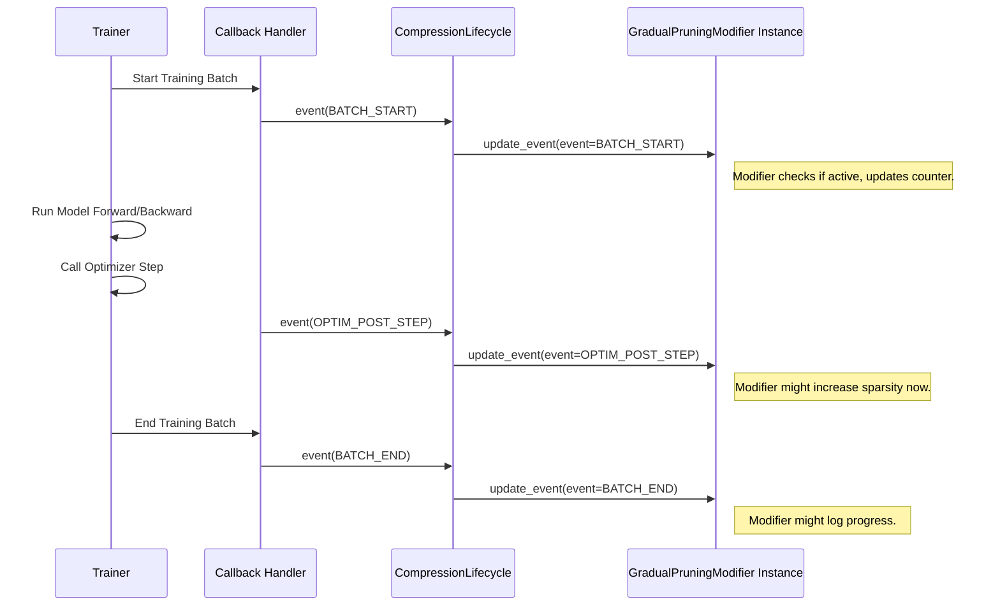

# Chapter 6: Compression Session & Lifecycle

Welcome back! In [Chapter 5: Observer](05_observer_.md), we saw how Observers act like sensors, gathering data during calibration to help [Modifiers](04_modifier_.md) like `QuantizationModifier` make smart decisions. We've now seen the core components: [Entrypoints](01_entrypoints___oneshot____train___.md) to start, [Arguments](02_arguments___modelarguments____datasetarguments____recipearguments____trainingarguments___.md) to configure, [Recipes](03_recipe_.md) as the plan, [Modifiers](04_modifier_.md) as the tools, and Observers as sensors.

But how does everything work together? If you have a [Recipe](03_recipe_.md) with multiple [Modifiers](04_modifier_.md) that need to act at different times (like starting pruning halfway through training), what component coordinates all of this? What keeps track of the overall process?

That's the job of the **Compression Session** and its **Compression Lifecycle**!

## What Problem Do They Solve? Coordination and Timing

Imagine you're a chef following a complex recipe (our compression [Recipe](03_recipe_.md)). The recipe has multiple steps: "Marinate the chicken for 1 hour" (prepare the model), "Preheat the oven halfway through marinating" (start gradual pruning), "Cook for 30 minutes" (apply quantization), "Let rest" (finalize changes).

You, the chef, need to manage the entire process:

1.  Keep track of all the ingredients and tools (the model, data, optimizer – this is the [State](07_state_.md)).
2.  Know *which* recipe step (which [Modifier](04_modifier_.md)) needs to happen *when*.
3.  Trigger the actions at the correct moments (like putting the chicken in the oven exactly when the timer goes off).

The **Compression Session (`CompressionSession`)** is like the head chef. It oversees the entire compression process. It holds the current context or **[State](07_state_.md)** (the model, optimizer, data, etc.) and manages the **Compression Lifecycle (`CompressionLifecycle`)**.

The **Compression Lifecycle (`CompressionLifecycle`)** is like the chef's detailed schedule or timer. It reads the [Recipe](03_recipe_.md), understands which [Modifiers](04_modifier_.md) are involved, and keeps track of where we are in the process (e.g., which training step we're on). Based on specific **Events** (like the start of a training batch or an optimizer update), the Lifecycle tells the active Modifiers, "Okay, it's your turn to act now!"

This ensures that complex compression strategies defined in a [Recipe](03_recipe_.md), potentially involving multiple [Modifiers](04_modifier_.md) acting at different times during `oneshot` calibration or `train` fine-tuning, are executed correctly and in the right order.

## Key Concepts

Let's break down the main parts:

1.  **Compression Session (`CompressionSession`)**:
    *   **What:** The main manager object for a compression run.
    *   **Role:** Holds the overall context ([State](07_state_.md)) and manages the Lifecycle. It's the central coordinator.
    *   **Analogy:** The head chef overseeing the whole cooking operation.

2.  **Compression Lifecycle (`CompressionLifecycle`)**:
    *   **What:** An object managed by the Session that tracks the progress of compression.
    *   **Role:** Reads the [Recipe](03_recipe_.md), knows which [Modifiers](04_modifier_.md) are active, and triggers their specific methods (`initialize`, `update_event`, `finalize`) based on Events.
    *   **Analogy:** The detailed schedule or timer the chef follows, specifying *when* each task needs to happen.

3.  **Events (`EventType`)**:
    *   **What:** Specific moments or triggers during the compression process. Examples include `BATCH_START`, `OPTIM_PRE_STEP` (before optimizer updates weights), `OPTIM_POST_STEP` (after optimizer updates weights), `BATCH_END`.
    *   **Role:** Signal to the Lifecycle that a specific point in the process has been reached, potentially triggering Modifier actions.
    *   **Analogy:** The specific alarms or notifications on the schedule (e.g., "Timer rings: Start preheating!", "Ingredient prep complete: Begin mixing!").

4.  **[State](07_state_.md)**:
    *   **What:** An object holding the current context: the model being compressed, the optimizer (if training), the data being used, etc.
    *   **Role:** Provides Modifiers with the necessary information and objects to work on when the Lifecycle triggers them.
    *   **Analogy:** The kitchen counter holding all the ingredients (data), tools (optimizer), and the dish being prepared (model). We'll cover this in detail in the next chapter.

## How Are They Used? (Mostly Automatic!)

Here's the good news for beginners: You usually **don't need to directly create or manage** the `CompressionSession` or `CompressionLifecycle` yourself!

*   **`oneshot` Entrypoint:** When you call `oneshot`, it internally creates a temporary Session and Lifecycle to manage the calibration and application of Modifiers specified in your [Recipe](03_recipe_.md). It handles the initialization, running calibration steps (which trigger internal events), and finalization automatically.
*   **`train` Entrypoint:** The `train` function (often used via the custom `Trainer` in `llm-compressor`) automatically sets up a `CompressionSession`. The custom `Trainer` is integrated with the `CompressionLifecycle`. It automatically triggers the correct `EventType`s (like `BATCH_START`, `OPTIM_POST_STEP`) at the right moments during the training loop.

You might see code like this, especially around the `train` function:

```python
# Example showing the implicit use of a session with 'train'

from llmcompressor import train, create_session

# Define model, dataset, output etc.
model_name = "hf-internal-testing/tiny-random-LlamaForCausalLM"
dataset_name = "wikitext"
output_dir = "./tiny_llama_trained_with_session"
recipe_path = "path/to/your/recipe.yaml" # A recipe with timed modifiers

# The 'create_session()' context manager sets up the environment
# for the train function to use the Compression Session & Lifecycle.
print("Starting training with session management...")
with create_session():
    train(
        model=model_name,
        recipe=recipe_path, # The recipe is passed here
        dataset=dataset_name,
        output_dir=output_dir,
        max_steps=100 # Example training argument
        # Other arguments...
    )
print("Training finished.")

# When 'train' runs inside 'create_session', it automatically:
# 1. Gets the active CompressionSession.
# 2. Calls session.initialize(recipe=recipe_path, model=model, ...)
# 3. During the training loop, calls session.lifecycle.event(EventType.BATCH_START), etc.
# 4. Calls session.finalize() when training completes.
```

In this common scenario, `create_session()` sets up the necessary context. The `train` function then interacts with the `CompressionSession` and `CompressionLifecycle` behind the scenes to execute the [Recipe](03_recipe_.md) correctly over the 100 training steps. You don't manage the events or lifecycle manually; the framework handles it.

## Under the Hood: How Coordination Happens

Let's peek behind the curtain to see how the `train` entrypoint uses the Session and Lifecycle to manage a [Modifier](04_modifier_.md) that needs to act during training (e.g., a pruning modifier that gradually increases sparsity).

**Step-by-Step Flow (Simplified):**

1.  **Session Setup:** The `with create_session():` block creates a new `CompressionSession` instance and makes it the "active" session. This session holds a `CompressionLifecycle` object and a `State` object.
2.  **Initialization:** The `train` function starts and calls `session.initialize(recipe=...)`.
    *   The `CompressionLifecycle` reads the [Recipe](03_recipe_.md).
    *   It creates instances of all the [Modifiers](04_modifier_.md) defined in the recipe (e.g., `GradualPruningModifier`).
    *   It calls the `initialize` method on each Modifier, passing them the `State` (so they can access the model, optimizer, etc.). The Modifier might prepare the model or set internal counters.
3.  **Training Loop Starts:** The `Trainer` begins iterating through batches of data.
4.  **Event Trigger (Start of Batch):** Before processing a batch, the `Trainer`'s callback mechanism calls `lifecycle.event(EventType.BATCH_START, ...)`.
    *   The `CompressionLifecycle` receives the event.
    *   It checks each active `Modifier` to see if it needs to react to `BATCH_START` (based on its configuration, like `start_epoch` or `frequency`).
    *   If a Modifier should react, the Lifecycle calls its `update_event(state, event)` method. The Modifier performs its action (e.g., updates its internal step count).
5.  **Forward/Backward Pass:** The `Trainer` runs the model forward, calculates the loss, and runs backward propagation.
6.  **Event Trigger (Optimizer Step):** *Before* the optimizer updates the model weights, the `Trainer` callback calls `lifecycle.event(EventType.OPTIM_PRE_STEP, ...)`. Modifiers might act here. *After* the optimizer updates weights, the callback calls `lifecycle.event(EventType.OPTIM_POST_STEP, ...)`.
    *   Again, the `CompressionLifecycle` notifies relevant `Modifiers` via their `update_event` method. A `GradualPruningModifier` might, for instance, increase the pruning level slightly after every few optimizer steps.
7.  **Event Trigger (End of Batch):** After the batch is fully processed, the callback calls `lifecycle.event(EventType.BATCH_END, ...)`. Relevant Modifiers are notified.
8.  **Loop Continues:** Steps 4-7 repeat for each batch.
9.  **Training Ends:** The `Trainer` finishes the training loop.
10. **Finalization:** The `train` function calls `session.finalize()`.
    *   The `CompressionLifecycle` calls the `finalize` method on each Modifier, allowing them to perform cleanup actions or apply final model changes (e.g., permanently removing pruned weights).

**Sequence Diagram (Simplified `train` Loop):**



This diagram shows how the `Trainer`, through callbacks, informs the `CompressionLifecycle` about `Events`, and the `Lifecycle` directs the appropriate `Modifiers` to act via their `update_event` method.

**Code Glimpse:**

The core classes are found in `src/llmcompressor/core/`.

*   **`CompressionSession` (`session.py`):** Manages the overall process.

    ```python
    # --- Simplified from src/llmcompressor/core/session.py ---
    from llmcompressor.core.lifecycle import CompressionLifecycle
    from llmcompressor.core.state import State, ModifiedState
    from llmcompressor.core.events import EventType

    class CompressionSession:
        def __init__(self):
            self._lifecycle = CompressionLifecycle() # Holds the lifecycle manager

        @property
        def lifecycle(self) -> CompressionLifecycle:
            return self._lifecycle

        @property
        def state(self) -> State:
            # Access the state via the lifecycle
            return self._lifecycle.state

        def initialize(self, recipe=None, model=None, optimizer=None, **kwargs) -> ModifiedState:
            # Calls lifecycle's initialize method
            mod_data = self._lifecycle.initialize(
                recipe=recipe, model=model, optimizer=optimizer, **kwargs
            )
            # Returns the potentially modified state (model, optimizer, etc.)
            return ModifiedState(...)

        def finalize(self, **kwargs) -> ModifiedState:
            # Calls lifecycle's finalize method
            mod_data = self._lifecycle.finalize(**kwargs)
            return ModifiedState(...)

        def event(self, event_type: EventType, **kwargs) -> ModifiedState:
            # Calls lifecycle's event handler method
            mod_data = self._lifecycle.event(event_type=event_type, **kwargs)
            return ModifiedState(...)

        def reset(self):
            self._lifecycle.reset()
    ```
    *Explanation:* The `CompressionSession` mainly delegates tasks (`initialize`, `finalize`, `event`) to its `CompressionLifecycle` instance and provides access to the shared `State`.

*   **`CompressionLifecycle` (`lifecycle.py`):** Tracks progress and triggers Modifiers.

    ```python
    # --- Simplified from src/llmcompressor/core/lifecycle.py ---
    from typing import List
    from llmcompressor.core.state import State
    from llmcompressor.core.events import Event, EventType
    from llmcompressor.recipe import RecipeContainer # Handles recipe loading
    from llmcompressor.modifiers import StageModifiers # Represents modifiers

    class CompressionLifecycle:
        def __init__(self):
            self.state: State = State() # Holds the current state
            self.recipe_container: RecipeContainer = RecipeContainer()
            self.modifiers: List[StageModifiers] = [] # List of active modifiers
            self.initialized_: bool = False
            self.finalized: bool = False
            self.global_step: int = 0 # Tracks training progress

        def initialize(self, recipe=None, **kwargs):
            self.state.update(**kwargs) # Update state with model, optimizer etc.
            self.recipe_container.append(recipe) # Load the recipe
            self.modifiers = self.recipe_container.get_modifiers() # Create modifiers

            for mod in self.modifiers:
                mod.initialize(state=self.state) # Call initialize on each modifier
            self.initialized_ = True

        def finalize(self, **kwargs):
            for mod in self.modifiers:
                mod.finalize(state=self.state) # Call finalize on each modifier
            self.finalized = True

        def event(self, event_type: EventType, global_step: int = 0, **kwargs):
            self.global_step = global_step # Update current step
            event = Event(type_=event_type) # Create event object

            for mod in self.modifiers:
                # Call update_event on each modifier, passing state and event
                mod.update_event(state=self.state, event=event, **kwargs)
            # ... (validation logic omitted) ...
    ```
    *Explanation:* The `CompressionLifecycle` holds the `State` and the list of `Modifiers`. Its `initialize`, `finalize`, and `event` methods iterate through the modifiers and call their corresponding methods at the right times.

*   **`EventType` (`events.py`):** Defines the different moments in the process.

    ```python
    # --- Simplified from src/llmcompressor/core/events.py ---
    from enum import Enum

    class EventType(Enum):
        INITIALIZE = "initialize"   # Process start
        FINALIZE = "finalize"       # Process end

        # Training specific events
        BATCH_START = "batch_start"         # Before processing a batch
        LOSS_CALCULATED = "loss_calculated" # After loss is computed
        OPTIM_PRE_STEP = "optim_pre_step"   # Before optimizer.step()
        OPTIM_POST_STEP = "optim_post_step" # After optimizer.step()
        BATCH_END = "batch_end"           # After processing a batch

        # Could add others like EPOCH_START, EPOCH_END etc.
    ```
    *Explanation:* This `Enum` simply provides named constants for the different lifecycle events that can be triggered.

These components work together seamlessly, orchestrated mainly by the `Trainer` during the `train` flow or managed internally by `oneshot`, to execute your compression [Recipe](03_recipe_.md) accurately.

## Conclusion

You've learned about the crucial management components in `llm-compressor`:

*   The **Compression Session (`CompressionSession`)** is the overall manager, like the head chef.
*   The **Compression Lifecycle (`CompressionLifecycle`)** is the detailed schedule or timer, tracking progress and triggering actions.
*   **Events (`EventType`)** are specific time points (like `BATCH_START`, `OPTIM_POST_STEP`) that trigger Lifecycle checks.
*   The Lifecycle uses these Events to call methods (`initialize`, `update_event`, `finalize`) on the active **[Modifiers](04_modifier_.md)** at the correct times, providing them with the current **[State](07_state_.md)**.

While these components are vital for coordinating complex compression workflows, you typically interact with them **indirectly** through the `oneshot` and `train` [Entrypoints](01_entrypoints___oneshot____train___.md). Understanding their roles helps clarify how `llm-compressor` executes your [Recipe](03_recipe_.md).

Speaking of the [State](07_state_.md) – the context holding the model, optimizer, and data – let's dive deeper into what it contains in the next chapter.

**Next:** [Chapter 7: State](07_state_.md)

---

Generated by [AI Codebase Knowledge Builder](https://github.com/The-Pocket/Tutorial-Codebase-Knowledge)
