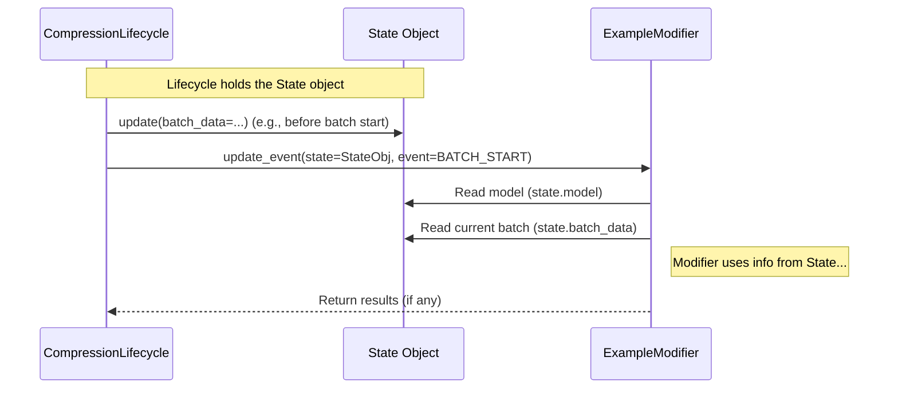

# Chapter 7: State

In [Chapter 6: Compression Session & Lifecycle](06_compression_session___lifecycle_.md), we learned how the `CompressionSession` and `CompressionLifecycle` act like the head chef and their schedule, coordinating the entire compression process and telling [Modifiers](04_modifier_.md) when to act based on Events.

But when a [Modifier](04_modifier_.md) (like our `QuantizationModifier` tool) is told "Okay, it's time to quantize!", how does it actually get access to the model it needs to modify? Or if it's a modifier that works during training, how does it find the optimizer or the current batch of data? This is where the **State** object comes in!

## What Problem Does State Solve? Accessing the Working Context

Imagine you're working in a busy workshop (the compression process). You have different tools ([Modifiers](04_modifier_.md)) for different tasks. When it's time to use a specific tool, say a wrench (`PruningModifier`), the wrench needs to know *which* bolt (part of the model) to tighten and might need access to the overall blueprint (training configuration).

The **State** object acts like the central **dashboard** or **control panel** for the entire compression workshop. It holds references to all the essential components and information needed at any given moment during the process. Think of it as a shared workspace where all the necessary items are readily available.

When the [Compression Lifecycle](06_compression_session___lifecycle_.md) tells a [Modifier](04_modifier_.md) to perform an action (e.g., during its `initialize` or `update_event` method), it also passes this `State` object to the modifier. This gives the modifier access to everything it might need, such as:

*   The `model` being compressed.
*   The `teacher_model` (if you're doing distillation).
*   The `optimizer` and `loss` function (important during the `train` entrypoint).
*   The various `data` loaders (like `train_data`, `val_data`, `calib_data`).
*   Information about the `hardware` (like which device, e.g., 'cuda:0').
*   Any `loggers` configured for tracking metrics.

Modifiers can then read this information from the `State` object to understand the context and perform their tasks correctly. Some modifiers might even update parts of the state (though this is less common), for example, by modifying the model or wrapping the optimizer.

## How State is Used (Accessed by Modifiers)

As a beginner user of `llm-compressor`, you **rarely need to create or directly manipulate the `State` object yourself**. It's automatically created and managed by the [Compression Session & Lifecycle](06_compression_session___lifecycle_.md).

The main way you'll encounter `State` is seeing it passed as an argument to the methods within a [Modifier](04_modifier_.md) if you ever decide to write your own custom modifier or look deep into the source code of existing ones.

Let's imagine a hypothetical simple `LoggingModifier` whose job is just to print the current device the model is running on at the beginning of the process.

```python
# --- Conceptual Example: A Modifier Accessing State ---
from llmcompressor.modifiers import Modifier
from llmcompressor.core import State # Import the State class

class LoggingModifier(Modifier):

    # The 'initialize' method receives the 'state' object
    def on_initialize(self, state: State, **kwargs) -> bool:
        print(f"My Modifier is initializing!")

        # --- Accessing information FROM the State object ---
        current_model = state.model
        current_device = state.hardware.device # Access hardware info
        optimizer = state.optimizer # Access the optimizer (might be None in oneshot)

        print(f"  - Found model: {type(current_model).__name__}")
        if current_device:
            print(f"  - Model is on device: {current_device}")
        else:
            print(f"  - Device information not available in state.")
        if optimizer:
             print(f"  - Found optimizer: {type(optimizer).__name__}")
        # -------------------------------------------------

        # This modifier doesn't change anything, just logs
        return True # Indicate initialization was successful

# --- In your recipe.yaml ---
# modifiers:
#   LoggingModifier: {} # No parameters needed for this simple modifier
```

**Explanation:**

1.  We define a `LoggingModifier` that inherits from the base `Modifier` class.
2.  Its `on_initialize` method (which is called by the [Compression Lifecycle](06_compression_session___lifecycle_.md) at the start) takes `state: State` as an argument.
3.  Inside the method, the modifier can access different parts of the context by reading attributes of the `state` object:
    *   `state.model` gives the model object.
    *   `state.hardware.device` gives the name of the device (e.g., 'cuda:0', 'cpu').
    *   `state.optimizer` gives the optimizer object (if one exists, typically during `train`).
4.  The modifier uses this information to print details about the current setup.

This example shows how a Modifier *uses* the `State` object passed to it as a read-only source of information about the ongoing compression process. The `State` acts as the bridge connecting the overall process managed by the Lifecycle to the specific actions performed by the Modifiers.

## Under the Hood: Creating and Managing State

Where does the `State` object come from, and how is it kept up-to-date?

1.  **Creation:** When a `CompressionSession` is started (often implicitly by `oneshot` or `train`, or explicitly using `with create_session():`), its associated `CompressionLifecycle` object creates an empty `State` object.
2.  **Initialization:** When the `session.initialize(...)` method is called (usually at the beginning of `oneshot` or `train`), the arguments you provide (like `model`, `optimizer`, `train_data`, etc.) are used to populate the fields within the `State` object.
3.  **Passing to Modifiers:** As the `CompressionLifecycle` calls methods on the [Modifiers](04_modifier_.md) (like `initialize`, `update_event`, `finalize`), it passes the *current* `State` object as an argument.
4.  **Updates (Less Common):** Certain actions might update the state during the process. For example, if a modifier wraps the optimizer, the `state.optimizer` attribute would be updated to point to the wrapped optimizer. The current `batch_data` is also often updated within the state during training loops.

**Sequence Diagram: Lifecycle Passing State to Modifier**

This diagram shows how the Lifecycle provides the State object to a Modifier when an event occurs.


This illustrates the flow: the Lifecycle manages the State and passes it to the Modifier, which then reads the necessary information from it.

**Code Glimpse:**

The `State` object is primarily defined as a Python `dataclass` in `src/llmcompressor/core/state.py`. Dataclasses are a convenient way to create classes that mostly just hold data.

```python
# --- Simplified from src/llmcompressor/core/state.py ---
from dataclasses import dataclass, field
from typing import Any, List, Optional, Union
from llmcompressor.metrics import LoggerManager

@dataclass
class Data:
    """Holds data sets"""
    train: Optional[Any] = None
    val: Optional[Any] = None
    calib: Optional[Any] = None
    # ... test data etc.

@dataclass
class Hardware:
    """Holds hardware info"""
    device: Optional[str] = None # e.g., 'cuda:0' or 'cpu'
    # ... other fields like rank, distributed info etc.

@dataclass
class State:
    """The main State dataclass"""
    # Core components
    model: Any = None
    teacher_model: Any = None
    optimizer: Any = None
    loss: Any = None

    # Data and Hardware context
    data: Data = field(default_factory=Data) # Uses the Data dataclass
    hardware: Hardware = field(default_factory=Hardware) # Uses Hardware dataclass

    # Other context
    loggers: Optional[LoggerManager] = None # For logging metrics
    batch_data: Any = None # Current batch being processed

    # Method to update the state
    def update(self, model: Any = None, optimizer: Any = None, **kwargs):
        # Logic to update fields based on input arguments
        if model is not None:
            self.model = model
        if optimizer is not None:
            self.optimizer = optimizer
        # ... update other fields like data, hardware from kwargs ...
        pass

```

*Explanation:*
*   You can see the `State` dataclass has fields for `model`, `optimizer`, `loss`, `data`, `hardware`, `loggers`, etc.
*   It uses other simple dataclasses like `Data` and `Hardware` to organize related information.
*   The `update` method (shown conceptually) is used internally by the [Compression Lifecycle](06_compression_session___lifecycle_.md) during initialization to populate the state from the arguments provided to `session.initialize()`.

The `CompressionLifecycle` object (in `src/llmcompressor/core/lifecycle.py`) holds an instance of this `State` class and is responsible for updating it and passing it to the modifiers.

```python
# --- Conceptual Snippet from CompressionLifecycle ---
from llmcompressor.core.state import State
# ... other imports

class CompressionLifecycle:
    def __init__(self):
        self.state: State = State() # Lifecycle creates and holds the State
        # ... other lifecycle attributes (modifiers, recipe) ...

    def initialize(self, model=None, optimizer=None, **kwargs):
        # Update the state with provided arguments
        self.state.update(model=model, optimizer=optimizer, **kwargs)

        # Initialize modifiers, passing the updated state
        for mod in self.modifiers:
            mod.initialize(state=self.state) # <<< State passed here

    def event(self, event_type, **kwargs):
        # Update state if necessary (e.g., current batch data)
        # self.state.batch_data = kwargs.get('batch_data')

        # Call update_event on modifiers, passing the current state
        for mod in self.modifiers:
            mod.update_event(state=self.state, event=...) # <<< State passed here
```

This connection shows how the Lifecycle acts as the custodian of the `State`, ensuring it's up-to-date and providing it to Modifiers when they need context.

## Conclusion

You've learned that the **State** object is the central dashboard or control panel for the `llm-compressor` process.

*   It holds references to crucial components like the `model`, `optimizer`, `data` loaders, `hardware` info, and `loggers`.
*   It provides the necessary **context** for [Modifiers](04_modifier_.md) to perform their actions correctly.
*   It's managed automatically by the [Compression Session & Lifecycle](06_compression_session___lifecycle_.md).
*   You typically don't interact with it directly, but [Modifiers](04_modifier_.md) receive it as an argument to access the current process state.

Understanding the `State` helps complete the picture of how all the pieces of `llm-compressor` – Session, Lifecycle, Modifiers, Recipe, Arguments – work together.

So far, we've mostly seen Modifiers applied either all at once (`oneshot`) or orchestrated over time (`train`). But how does `llm-compressor` handle applying techniques layer-by-layer, which is common in some advanced compression methods? This involves **Pipelines**.

**Next:** [Chapter 8: Pipelines (`sequential`, `layer_sequential`, `basic`)](08_pipelines___sequential____layer_sequential____basic___.md)

---

Generated by [AI Codebase Knowledge Builder](https://github.com/The-Pocket/Tutorial-Codebase-Knowledge)