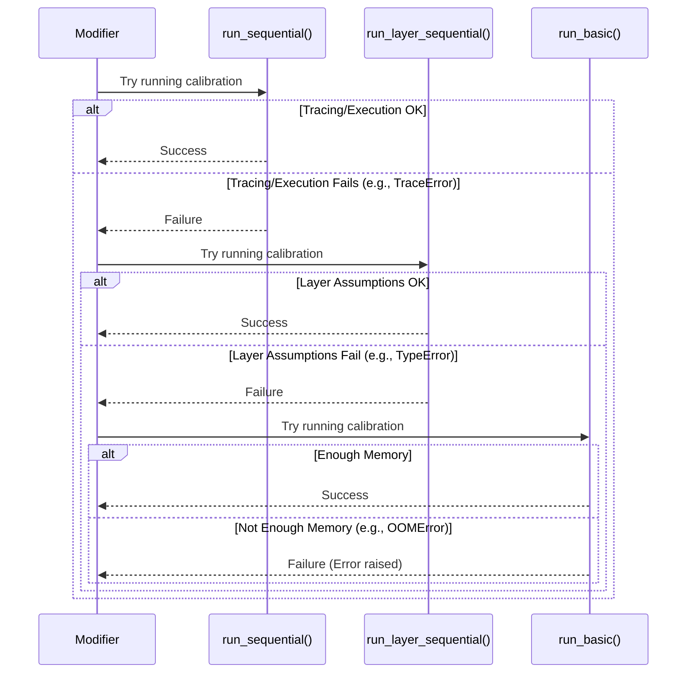

# Chapter 8: Pipelines (`sequential`, `layer_sequential`, `basic`)

In [Chapter 7: State](07_state_.md), we saw how the `State` object provides the necessary context (like the model and data) for [Modifiers](04_modifier_.md) to do their work. Now, let's consider *how* some of these modifiers, especially memory-hungry ones, actually run their processes using calibration data.

## What Problem Do Pipelines Solve? Managing Memory During Calibration

Imagine you're using a powerful but memory-intensive compression technique like GPTQ or SparseGPT. These methods belong to the `oneshot` family ([Chapter 1: Entrypoints (`oneshot`, `train`)](01_entrypoints___oneshot____train___.md)) and often require **calibration data** – a small set of examples fed through the model to help the algorithm make better compression decisions.

Now, what if your model is *huge*? Feeding even a single batch of calibration data through the entire model might require more GPU memory than you have available! This is a common problem with large language models. How can `llm-compressor` apply these techniques without running out of memory?

The answer lies in **Pipelines**. Pipelines define different strategies for executing the calibration part of the compression process, specifically designed to manage memory usage effectively.

Think of it like reading a very long and complex book (your large model) to gather information (calibration):

*   You could try to read the entire book in one sitting (`basic` pipeline). This is simple but might overload your brain (run out of memory).
*   You could read it chapter by chapter, taking notes after each (`layer_sequential` pipeline). This is better for memory but assumes the book has clear, independent chapters (simple model structure).
*   You could read it section by section, understanding the connections between them, and summarizing before moving on (`sequential` pipeline). This is the most flexible approach, handling complex structures while still managing memory.

`llm-compressor` offers these different pipeline strategies to handle various model sizes and complexities during calibration.

## The Different Pipelines

Let's look at the three main pipeline strategies:

1.  **`basic` Pipeline:**
    *   **How it works:** This is the simplest approach. It takes the calibration data and runs it through the *entire* model in one go, just like a standard forward pass.
    *   **Pros:** Very simple concept.
    *   **Cons:** Uses the most memory because the entire model and its activations for the calibration batch need to fit in memory simultaneously. Often infeasible for large models.
    *   **Analogy:** Trying to memorize a whole phone book page at once.

2.  **`layer_sequential` Pipeline:**
    *   **How it works:** This pipeline processes the model **layer by layer**. It identifies the main layers (like the transformer blocks in many LLMs). For each calibration batch, it runs the data *only* through the first layer, **caches** the output of that layer (often saving it to CPU memory), then runs the cached output through the second layer, caches *its* output, and so on.
    *   **Pros:** Significantly reduces peak memory usage because only one layer (and its inputs/outputs) needs to be active on the GPU at a time.
    *   **Cons:** Relies on a clear, sequential layer structure where the output of one layer is the direct input to the next. Fails on models with more complex connections (like skip connections that span multiple layers or encoder-decoder architectures).
    *   **Analogy:** Reading a recipe step-by-step, completing step 1 fully before moving to step 2.

3.  **`sequential` Pipeline (Default & Recommended):**
    *   **How it works:** This is the most sophisticated and generally preferred pipeline. It uses a technique called **model tracing** (which we'll explore in [Chapter 9: Tracing](09_tracing_.md)) to analyze the model's structure and understand how data flows through it, even with complex dependencies like skip connections. It automatically breaks the model down into smaller, manageable chunks called **subgraphs**. It then processes these subgraphs sequentially, similar to `layer_sequential`, running calibration data through one subgraph at a time and **caching** the intermediate results needed for the next subgraph.
    *   **Pros:** Best memory efficiency for large, complex models. Handles intricate data dependencies between different parts of the model gracefully.
    *   **Cons:** Relies on the model being "traceable" (most standard Hugging Face models are, or can be made so). The tracing step itself adds a small overhead at the beginning.
    *   **Analogy:** Reading a complex technical manual by breaking it into logical sections, understanding each section and its diagrams (subgraphs) before moving to the next, keeping track of necessary information (caching).

## How Are Pipelines Used? (Usually Automatic!)

Here's the key takeaway for beginners: You typically **do not need to manually select a pipeline**.

[Modifiers](04_modifier_.md) that require calibration and are sensitive to memory (like `GPTQModifier` or `SparseGPTModifier`) are smart enough to manage this automatically! When you use them within the `oneshot` entrypoint, they follow a fallback strategy:

1.  **Try `sequential`:** They first attempt to use the most robust and memory-efficient `sequential` pipeline. This involves tracing the model.
2.  **Fallback to `layer_sequential`:** If tracing fails (e.g., the model has some structure that the tracer can't handle), the modifier will automatically catch the error, issue a warning, and try the `layer_sequential` pipeline instead.
3.  **Fallback to `basic`:** If `layer_sequential` also fails (e.g., the model structure doesn't fit the layer-by-layer assumption), the modifier will catch the error, warn again, and finally attempt the `basic` pipeline.
4.  **Fail (Out of Memory):** If even the `basic` pipeline requires too much memory, the process will likely fail with an Out-of-Memory (OOM) error.

Let's look at an example using `GPTQModifier`. Remember, the pipeline selection is happening *inside* the `oneshot` call.

```python
# --- 1. Import necessary tools ---
from llmcompressor import oneshot
from llmcompressor.modifiers.quantization import GPTQModifier # A Modifier that uses calibration

# --- 2. Define which model to compress ---
MODEL_ID = "hf-internal-testing/tiny-random-LlamaForCausalLM" # A small model for example
# For a large model like Llama-3-70B, memory becomes critical!

# --- 3. Define the compression "recipe" ---
# We use GPTQ, which needs calibration and benefits from smart pipelines
recipe = GPTQModifier(
    block_size=128,
    config_groups={
        "group_0": {
            "targets": ["Linear"], # Target Linear layers
            "weights": {
                "num_bits": 4, # 4-bit quantization
                "type": "int",
                "symmetric": True,
                "strategy": "channel",
            }
        }
    }
)

# --- 4. Run the oneshot compression! ---
print("Starting oneshot compression with GPTQ...")
try:
    oneshot(
        model=MODEL_ID,
        recipe=recipe,
        dataset="wikitext", # Calibration dataset
        num_calibration_samples=64,
        output_dir="./tiny_llama_gptq"
        # *** Pipeline selection happens AUTOMATICALLY inside here! ***
        # GPTQModifier will try run_sequential, then run_layer_sequential, then run_basic.
    )
    print("Compression finished successfully!")
except Exception as e:
    print(f"Compression failed: {e}")
    # If it was an OutOfMemoryError, it means even the basic pipeline failed.
```

**Explanation:**

When you call `oneshot` with `GPTQModifier`, the modifier's internal logic (specifically its `on_initialize` method) will execute the calibration data run. It doesn't ask you which pipeline to use; it tries `sequential` first because it's generally the best. If that encounters an issue (like a `TraceError`), it automatically falls back to trying `layer_sequential`. If that *also* fails (perhaps with a `TypeError` if the model structure is unsuitable), it falls back one last time to `basic`. You'll usually see warnings in the console output if a fallback occurs.

## Under the Hood: The Fallback Mechanism

Let's visualize how a modifier like `GPTQModifier` or `SparseGPTModifier` handles the pipeline choice internally during its initialization phase when running `oneshot`.

1.  **Goal:** Run calibration data through the model to gather statistics (e.g., Hessians for GPTQ).
2.  **Attempt 1: `sequential` Pipeline:**
    *   Call `run_sequential(model, dataloader, sequential_targets, ignore, self)`.
    *   This involves tracing the model into subgraphs.
    *   If tracing and execution succeed: Great! Calibration is done efficiently.
    *   If tracing fails (`TraceError`) or execution fails: Catch the exception, issue a warning.
3.  **Attempt 2: `layer_sequential` Pipeline:**
    *   Call `run_layer_sequential(model, dataloader, sequential_targets, self)`.
    *   This involves identifying layers and running them one by one, caching intermediates.
    *   If execution succeeds: Good! Calibration is done, though maybe less robustly than `sequential`.
    *   If execution fails (e.g., `TypeError` due to architecture mismatch): Catch the exception, issue a warning.
4.  **Attempt 3: `basic` Pipeline:**
    *   Call `run_basic(model, dataloader, self)`.
    *   This runs the data through the whole model at once.
    *   If execution succeeds: Okay, calibration is done, but it might have used a lot of memory.
    *   If execution fails (e.g., `OutOfMemoryError`): The exception is likely not caught here and propagates up, causing the `oneshot` process to fail.

**Sequence Diagram of Fallback:**



**Code Glimpse:**

You can see this fallback logic within the `on_initialize` methods of modifiers like `GPTQModifier` (in `src/llmcompressor/modifiers/quantization/gptq/base.py`) or `SparseGPTModifier` (in `src/llmcompressor/modifiers/obcq/sgpt_mixin.py`).

```python
# --- Simplified excerpt from a Modifier's on_initialize method ---
from llmcompressor.pipelines.basic import run_pipeline as run_basic
from llmcompressor.pipelines.layer_sequential import run_pipeline as run_layer_sequential
from llmcompressor.pipelines.sequential import run_pipeline as run_sequential
import torch
import warnings

# Inside the Modifier class...
def on_initialize(self, state: "State", **kwargs) -> bool:
    # ... (setup code, find targets, register hooks) ...

    model = state.model
    dataloader = state.data.calib
    # sequential_targets and ignore lists are determined earlier

    # Try the 'sequential' pipeline first
    try:
        run_sequential(
            model,
            dataloader,
            self.sequential_targets,
            self.ignore,
            self, # Pass self for callbacks
        )
        return True # Success!

    except Exception as exception_seq:
        # Handle specific errors if needed, e.g., TraceError
        if isinstance(exception_seq, torch.fx.proxy.TraceError):
             warnings.warn("Failed to trace model. Falling back...")
        # Handle errors that cannot be fixed by fallback
        unfixable_errors = (torch.OutOfMemoryError, KeyboardInterrupt)
        if isinstance(exception_seq, unfixable_errors):
             raise exception_seq # Don't try fallback if it's OOM already

        warnings.warn(f"Sequential pipeline failed ({type(exception_seq).__name__}). Falling back to layer_sequential.")

        # Try the 'layer_sequential' pipeline
        try:
            run_layer_sequential(
                model,
                dataloader,
                self.sequential_targets,
                self, # Pass self for callbacks
            )
            return True # Success!

        except Exception as exception_layer:
             if isinstance(exception_layer, unfixable_errors):
                 raise exception_layer
             warnings.warn(
                 f"Layer sequential pipeline failed ({type(exception_layer).__name__}). Falling back to basic."
             )

             # Try the 'basic' pipeline as a last resort
             # No try-except here; if this fails (e.g., OOM), let it fail.
             run_basic(
                 model,
                 dataloader,
                 self, # Pass self for callbacks
             )
             return True # Success!

# Helper functions called by the pipelines:
# run_sequential uses trace_subgraphs(...) from src/llmcompressor/pipelines/sequential/helpers.py
# run_layer_sequential uses match_modules(...) and capture_first_layer_intermediates(...)
#   from src/llmcompressor/pipelines/layer_sequential/helpers.py
# run_basic is simpler, mostly loops and calls model(**batch)
#   from src/llmcompressor/pipelines/basic/pipeline.py
# IntermediatesCache from src/llmcompressor/pipelines/cache.py is used by sequential and layer_sequential.
```

This code structure clearly shows the intended priority: `sequential` > `layer_sequential` > `basic`.

## Conclusion

You've learned about the different **Pipelines** (`basic`, `layer_sequential`, `sequential`) that `llm-compressor` uses to manage the execution of memory-intensive calibration steps, especially for large models.

*   **`basic`:** Simple, runs the whole model, memory-hungry.
*   **`layer_sequential`:** Processes layer-by-layer, saves memory, assumes simple architecture.
*   **`sequential`:** Uses model tracing, breaks into subgraphs, best memory savings and handles complex models, requires the model to be traceable.

Crucially, you usually **don't choose** the pipeline. Memory-aware [Modifiers](04_modifier_.md) like `GPTQModifier` automatically **try `sequential` first, then fall back** to `layer_sequential`, and finally `basic` if needed.

The `sequential` pipeline relies heavily on the concept of "tracing" to understand the model's structure. What exactly is tracing, and how does it work?

Let's explore that in the final chapter of this introductory tutorial!

**Next:** [Chapter 9: Tracing](09_tracing_.md)

---

Generated by [AI Codebase Knowledge Builder](https://github.com/The-Pocket/Tutorial-Codebase-Knowledge)