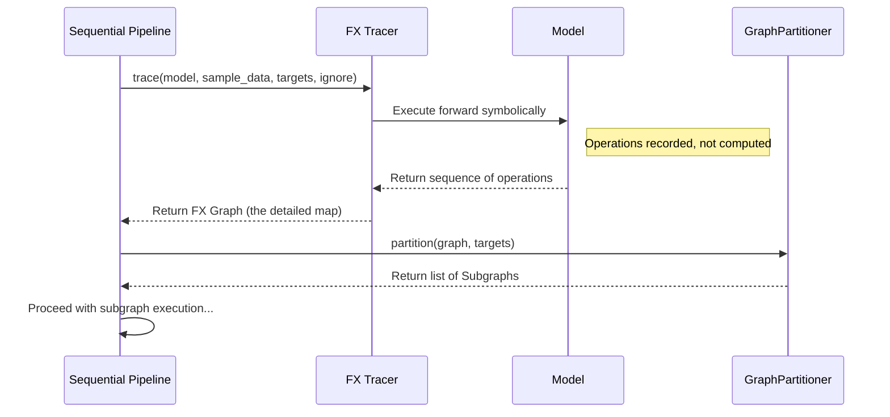

# Chapter 9: Tracing

Welcome to the final chapter of our introductory tutorial! In [Chapter 8: Pipelines (`sequential`, `layer_sequential`, `basic`)](08_pipelines___sequential____layer_sequential____basic___.md), we learned how different pipelines, especially the `sequential` pipeline, help manage memory during the calibration phase of compression techniques like GPTQ. We saw that the `sequential` pipeline is the most robust because it can handle complex model structures.

But how does the `sequential` pipeline understand these complex structures? If a model isn't just a simple sequence of layers (like Layer 1 -> Layer 2 -> Layer 3), how does the pipeline know exactly how data flows between different parts? This is where **Tracing** comes in!

## What Problem Does Tracing Solve? Mapping Complex Data Flow

Imagine you have a road map. A simple map might just list the towns you pass through sequentially: Town A -> Town B -> Town C. This is like the `layer_sequential` pipeline's assumption.

But real road networks have intersections, bypasses, and loops! A detailed map shows *exactly* how roads connect, even if they're complex.

Similarly, modern models, especially vision-language models or those with sophisticated attention mechanisms (like skip connections where data jumps over several layers), aren't always simple sequential blocks. The output of one part might feed into several other parts later on, not just the immediately following block.

The `layer_sequential` pipeline, assuming a simple A->B->C flow, would get confused by these complex connections when trying to save and reload intermediate results. This could lead to errors or incorrect compression.

**Tracing** solves this by creating that **detailed map** of your model's execution. It carefully records every operation and how data moves between them during a typical forward pass. This allows the `sequential` pipeline to:

1.  **Understand the exact data dependencies:** Know precisely which intermediate results are needed for which subsequent operations, even across complex connections.
2.  **Accurately replay execution:** Break the model into correct subgraphs (logical sections based on the traced map) and run them one by one, correctly caching and reloading the necessary intermediate data (activations) between subgraphs.

This detailed map ensures the `sequential` pipeline can manage memory effectively *without* breaking the model's logic, even for very complex architectures.

## Key Concepts: Symbolic Execution

*   **What is Tracing?** It's the process of running the model with sample input data, but instead of actually calculating the numerical results, it records the *sequence of operations* performed (like "call layer norm", "call linear layer", "add results").
*   **`torch.fx`:** This is the PyTorch library that `llm-compressor` uses under the hood to perform tracing. It allows for "symbolic execution" – running the code to capture the structure rather than the numerical output.
*   **Graph Representation:** The output of tracing is a `Graph` object. This graph is the detailed map, containing nodes representing operations and edges representing the data flow between them.
*   **Subgraphs:** The `sequential` pipeline uses this traced graph to intelligently partition the model into smaller, executable **subgraphs**. These subgraphs respect the complex data dependencies identified during tracing.

**Analogy:** Think of tracing like watching someone assemble a complex LEGO model. You don't build it yourself (no heavy computation), but you carefully write down every single step they take and which specific pieces connect where. This instruction list (the traced graph) allows someone else (the `sequential` pipeline) to correctly assemble the model piece by piece later, even if the instructions are complex.

## How is Tracing Used? (Automatically by `sequential` Pipeline)

Good news! As a beginner, you **almost never need to manually trigger tracing**.

Tracing is an internal mechanism used primarily by the **`sequential` pipeline**. As we discussed in [Chapter 8: Pipelines (`sequential`, `layer_sequential`, `basic`)](08_pipelines___sequential____layer_sequential____basic___.md), when you use a memory-intensive [Modifier](04_modifier_.md) (like `GPTQModifier`) with the `oneshot` entrypoint, it automatically tries to use the `sequential` pipeline first.

When the `sequential` pipeline starts its work (running calibration data), its *first step* is to perform tracing on your model using a sample batch of data.

```python
# (Code from Chapter 8, highlighting where tracing happens)
from llmcompressor import oneshot
from llmcompressor.modifiers.quantization import GPTQModifier

MODEL_ID = "hf-internal-testing/tiny-random-LlamaForCausalLM"
recipe = GPTQModifier(...) # Recipe requiring calibration

print("Starting oneshot compression...")
oneshot(
    model=MODEL_ID,
    recipe=recipe,
    dataset="wikitext",
    num_calibration_samples=64,
    output_dir="./tiny_llama_gptq"
    # *** Tracing happens INSIDE here! ***
    # The sequential pipeline (tried first by GPTQModifier)
    # will call its tracing function automatically before
    # running calibration layer-by-layer (or subgraph-by-subgraph).
)
print("Compression finished!")
```

So, tracing is a hidden but crucial setup step for the `sequential` pipeline, enabling its memory-saving execution strategy for complex models. If tracing fails for some reason (some models have operations that `torch.fx` struggles with), the pipeline system automatically falls back to `layer_sequential` or `basic`, as explained in Chapter 8.

## Under the Hood: Symbolic Execution with `torch.fx`

Let's quickly peek at what happens when the `sequential` pipeline initiates tracing:

1.  **Get Sample Data:** The pipeline takes one batch of data from the provided calibration dataloader.
2.  **Initialize Tracer:** It uses a specialized tracer, often based on `transformers.utils.fx.HFTracer`, configured to understand Hugging Face models. It also knows which modules to treat as "leaf" nodes (like the main transformer layers specified in `sequential_targets`) and which to ignore (from the `ignore` list in the recipe or modifier).
3.  **Symbolic Forward Pass:** The tracer runs the model's `forward` method with the sample data. However, instead of computing actual numbers, `torch.fx` intercepts operations.
    *   When it sees `output = self.linear_layer(input)`, it doesn't run the linear layer. Instead, it records a node like: `Node(op='call_module', target='linear_layer', args=(input_node,))`.
    *   When it sees `result = x + y`, it records: `Node(op='call_function', target=torch.add, args=(x_node, y_node))`.
4.  **Build Graph:** This process continues through the entire forward pass, building a directed acyclic graph (DAG) where nodes are operations and edges show data dependencies.
5.  **Partition Graph:** The `sequential` pipeline receives this complete `Graph`. It then uses the graph's structure and the list of `sequential_targets` to divide the graph into a sequence of smaller `Subgraph` objects. Each subgraph contains a manageable chunk of the model's operations.
6.  **Execute Subgraphs:** The pipeline then proceeds to execute these subgraphs one by one, using the `IntermediatesCache` to pass necessary data between them, as described in Chapter 8.

**Simplified Sequence Diagram:**



**Code Glimpse:**

The main logic for tracing within the sequential pipeline lives in `src/llmcompressor/pipelines/sequential/helpers.py`, particularly the `trace_subgraphs` function.

```python
# --- Simplified concept from src/llmcompressor/pipelines/sequential/helpers.py ---
from typing import List, Dict, Any
from torch.fx import GraphModule
from torch.nn import Module
from transformers.utils.fx import HFTracer # Hugging Face aware tracer

def trace_subgraphs(
    model: Module,
    sample_input: Dict[str, Any],
    sequential_targets: List[str], # e.g., ["LlamaDecoderLayer"]
    ignore: List[str]              # e.g., ["lm_head"]
) -> List['Subgraph']: # Returns list of partitioned subgraphs

    # 1. Find the actual module objects matching target/ignore names
    target_modules = match_modules(model, sequential_targets)
    ignore_modules = match_modules(model, ignore)

    # 2. Get a tracer configured to not trace inside target/ignore modules
    tracer = get_tracer(model, target_modules, ignore_modules)

    # 3. Perform the symbolic trace using torch.fx
    #    'graph' contains the detailed map of operations
    traced_graph: GraphModule = GraphModule(
        model,
        tracer.trace(model, dummy_inputs=sample_input, ...) # Symbolic execution
    )

    # 4. Partition the traced graph into subgraphs based on targets
    partitions = topological_partition(traced_graph, target_modules)
    subgraphs = partition_graph(model, partitions) # Convert partitions to Subgraph objects

    # 5. Figure out which inputs/outputs are needed for caching
    trace_consumed_names(subgraphs)

    return subgraphs

# --- Helper functions (simplified) ---
def get_tracer(model, target_modules, ignore_modules) -> HFTracer:
    # Creates an HFTracer instance that knows which modules are leafs
    class CustomTracer(HFTracer):
        def is_leaf_module(self, m: Module, module_qualified_name: str) -> bool:
            return m in target_modules or m in ignore_modules or super().is_leaf_module(...)
    return CustomTracer()

def topological_partition(graph, targets) -> List[List['Node']]:
    # Logic to divide graph.nodes into lists based on dependencies and targets
    pass # Complex graph algorithm

def partition_graph(model, partitions) -> List['Subgraph']:
    # Converts lists of nodes into executable Subgraph objects
    pass # Creates new small GraphModule for each partition
```

This shows the core steps: get a tracer, perform the symbolic trace to get the full graph, and then partition that graph into executable subgraphs for the pipeline.

**Traceable Models:** Sometimes, a model's code might use Python features that `torch.fx` cannot easily handle symbolically (like complex control flow based on tensor values). In these cases, tracing might fail. `llm-compressor` provides modified ("traceable") versions of some popular Hugging Face models in `src/llmcompressor/transformers/tracing/` that make small adjustments to allow tracing. There's also a guide (`GUIDE.md` in that directory) if you encounter untraceable models.

## Conclusion

You've reached the end of our introductory journey through `llm-compressor`! In this final chapter, we explored **Tracing**:

*   It's like creating a **detailed map** of your model's execution flow using symbolic execution (`torch.fx`).
*   It's essential for the **`sequential` pipeline** ([Chapter 8: Pipelines (`sequential`, `layer_sequential`, `basic`)](08_pipelines___sequential____layer_sequential____basic___.md)) to handle complex model architectures correctly while saving memory.
*   Tracing allows the pipeline to break the model into **subgraphs** that respect intricate data dependencies.
*   It usually happens **automatically** when memory-intensive [Modifiers](04_modifier_.md) use the `sequential` pipeline during `oneshot` calibration.

Understanding tracing helps clarify *how* `llm-compressor` manages complex models efficiently.

We hope this tutorial, covering [Entrypoints](01_entrypoints___oneshot____train___.md), [Arguments](02_arguments___modelarguments____datasetarguments____recipearguments____trainingarguments___.md), [Recipes](03_recipe_.md), [Modifiers](04_modifier_.md), [Observers](05_observer_.md), the [Compression Session & Lifecycle](06_compression_session___lifecycle_.md), [State](07_state_.md), [Pipelines](08_pipelines___sequential____layer_sequential____basic___.md), and Tracing, has given you a solid foundation for using `llm-compressor`.

From here, you can explore existing recipes in the Zoo, try different modifiers, or even dive deeper into creating your own custom compression techniques! Happy compressing!

---

Generated by [AI Codebase Knowledge Builder](https://github.com/The-Pocket/Tutorial-Codebase-Knowledge)