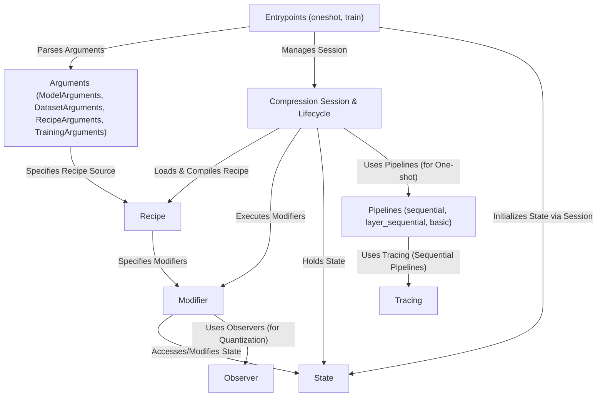

# Tutorial: llm-compressor

`llm-compressor` is a library designed to **compress** large language models (LLMs) to make them smaller and faster.
It uses *Recipes* (YAML files) that act like instruction manuals, specifying which compression *Modifiers* (algorithms like pruning or quantization) to apply.
Users interact with the library through main *Entrypoints* (`oneshot` for post-training compression and `train` for compression-aware fine-tuning), configuring the process with various *Arguments*.
The core *Compression Session* manages the execution lifecycle, applying modifiers based on the recipe and maintaining the current *State* (model, data, etc.).
For complex models or memory-intensive one-shot methods, specialized *Pipelines* (like `sequential`) are used, potentially involving *Tracing* to map data flow. Quantization modifiers rely on *Observers* to determine optimal parameters during calibration.

**Compressor source repository:** [https://github.com/vllm-project/llm-compressor](https://github.com/vllm-project/llm-compressor)

## Chapters

1. [Entrypoints (`oneshot`, `train`)](01_entrypoints___oneshot____train___)
2. [Arguments (`ModelArguments`, `DatasetArguments`, `RecipeArguments`, `TrainingArguments`)](02_arguments___modelarguments____datasetarguments____recipearguments____trainingarguments___)
3. [Recipe](03_recipe_)
4. [Modifier](04_modifier_)
5. [Observer](05_observer_)
6. [Compression Session & Lifecycle](06_compression_session___lifecycle_)
7. [State](07_state_)
8. [Pipelines (`sequential`, `layer_sequential`, `basic`)](08_pipelines___sequential____layer_sequential____basic___)
9. [Tracing](09_tracing_)

---

Generated by [AI Codebase Knowledge Builder](https://github.com/The-Pocket/Tutorial-Codebase-Knowledge)
